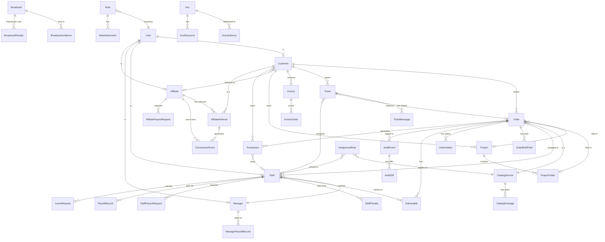

# DATA-MODEL.md — HevaSEO Backend Blueprint

Inferred from Phase-0 mock TypeScript modules in `apps/app/src/data/` and `apps/app/src/lib/`.
All field types and enum values are exactly as declared in the source; nothing here is speculative.

---

## 1. Entity Catalog

### 1.1 User (base identity table — 5 roles share one auth table)

Derived from `lib/rbac.ts` roles and scattered persona fields across mock files.

| Field | Type | Notes |
|---|---|---|
| `id` | uuid PK | |
| `email` | text UNIQUE NOT NULL | login credential |
| `name` | text | display name |
| `role` | enum `Role` | `admin \| manager \| staff \| customer` + `affiliate` (portal-level) |
| `status` | enum | `active \| invited \| disabled` (AdminAccount shape) |
| `two_fa_enabled` | bool | from `AdminAccount.twoFA` |
| `created_at` | timestamptz | |
| `last_active_at` | timestamptz | |

> `affiliate` is functionally a fifth role not declared in `rbac.ts` (it's a separate portal); unify or keep separate table per implementation choice — see §5.

---

### 1.2 Customer

Source: `AdminCustomer` + `CustomerExtra` in `adminMock.ts`.

| Field | Type | Notes |
|---|---|---|
| `id` | text PK | `c1`…`c11` in mock |
| `user_id` | uuid FK → User | null when `status = 'shadow'` (unclaimed order) |
| `name` | text | |
| `company` | text | |
| `email` | text | |
| `status` | enum | `shadow \| claimed` |
| `tier` | enum `Tier` | `new \| silver \| gold \| vip` (derived from `spend`, but must be stored for fast lookup) |
| `spend` | numeric | lifetime spend in USD |
| `balance` | numeric | wallet credit balance (USD) |
| `last_active_at` | date | |
| `phone` | text | from `CustomerExtra` |
| `timezone` | text | IANA tz string |
| `member_since` | date | from `CustomerExtra` |
| `tags` | text[] | e.g. `['Retainer','E-commerce']` |
| `referrer_id` | text FK → Affiliate | null if organic; from `CUSTOMER_REFERRER` |

**Relationships:** Customer → Orders (1:many), Customer → Tickets (1:many), Customer → Invoices (1:many), Customer → Projects (1:many).

---

### 1.3 Project & Folder

Source: `CustProject` in `adminMock.ts`; `Project`, `FOLDERS` in `mock.ts`.

**projects**

| Field | Type | Notes |
|---|---|---|
| `id` | text PK | |
| `customer_id` | text FK → Customer | |
| `name` | text | e.g. `'Main site'` |
| `site` | text | domain the project is about |
| `status` | enum | `progress \| completed \| planned` |
| `note` | text | |
| `updated_at` | date | |
| `label` | text | short display label |

**project_folders**

| Field | Type | Notes |
|---|---|---|
| `id` | text PK | |
| `project_id` | text FK → Project | |
| `name` | text | e.g. `'Money pages'` |

Orders carry a `project_id` + `folder_id` (optional).

---

### 1.4 CatalogItem (Service + Package)

Source: `SvcCatalog`, `SvcPackage`, `SvcGroup` in `services.ts`; `SKILL_META`, `SERVICE_SKILL`, `GIG_RATE` in `adminMock.ts`.

**catalog_services** (one per service key)

| Field | Type | Notes |
|---|---|---|
| `id` | text PK | `ServiceKey`: `backlink \| content \| indexer \| audit \| optimize \| keyword \| design` |
| `name` | text | display name |
| `skill_id` | text | maps to `SKILL_META` key |
| `tagline` | text | |
| `hero` | text | intro paragraph |
| `order_title` | text | board card title |

**catalog_packages**

| Field | Type | Notes |
|---|---|---|
| `id` | text PK | |
| `service_id` | text FK → catalog_services | |
| `group_id` | text FK → catalog_groups nullable | for grouped plans |
| `name` | text | e.g. `'Starter'`, `'Growth'`, `'Power'` |
| `price` | numeric | USD; 0 when `price_label` is set |
| `price_label` | text nullable | e.g. `'Get a quote'` |
| `sla` | text | human SLA label e.g. `'~2 days'` |
| `popular` | bool | |
| `summary` | text | |
| `features` | text[] | |
| `gig_rate` | numeric | staff piece-rate for this (service, package) combo; from `GIG_RATE` |

**catalog_addons** (upsells shown at checkout)

Sourced from `@heva/catalog` package (shared with marketing site). Store: `id`, `name`, `tier`, `price`, `service_id FK`.

---

### 1.5 Order

Source: `AdminOrder` in `adminMock.ts`; `Order` in `mock.ts` (customer-facing view).

| Field | Type | Notes |
|---|---|---|
| `id` | text PK | `o1`…`o38` in admin mock |
| `code` | text UNIQUE | e.g. `'AUD-1001'` |
| `customer_id` | text FK → Customer | |
| `service_id` | text FK → catalog_services | |
| `pkg` | text | package name at time of order (denormalize or FK to `catalog_packages`) |
| `value` | numeric | order value in USD |
| `status` | enum `OrderStatus` | `new \| confirmed \| assigned \| in_progress \| internal_review \| delivered \| changes_requested \| approved \| completed \| canceled` |
| `priority` | enum `Priority` | `low \| med \| high` |
| `source` | enum | `quick \| dashboard` |
| `staff_id` | text FK → Staff nullable | assigned staff member |
| `deadline` | date nullable | |
| `created_at` | date | |
| `assigned_at` | date nullable | when routing happened (mock: `ORDER_ASSIGNED_AT`) |
| `project_id` | text FK → projects nullable | |
| `folder_id` | text FK → project_folders nullable | |
| `note` | text nullable | client-specific instruction (`ORDER_NOTE`) |

**order_brief_fields** (intake brief from checkout)

| Field | Type | Notes |
|---|---|---|
| `id` | uuid PK | |
| `order_id` | text FK → Order | |
| `label` | text | e.g. `'Website'`, `'Target market'` |
| `value` | text | |
| `full` | bool | spans full width in UI |
| `sort` | int | display order |

**order_addons** (upsells bundled at checkout)

| Field | Type | Notes |
|---|---|---|
| `id` | uuid PK | |
| `order_id` | text FK → Order | |
| `addon_name` | text | |
| `tier` | text | |
| `price` | numeric | |

**order_bundle** (linked orders placed together)

| Field | Type | Notes |
|---|---|---|
| `parent_order_id` | text FK → Order | |
| `child_order_id` | text FK → Order | |

---

### 1.6 Deliverable

Source: `AdminDeliverable` in `adminMock.ts`.

| Field | Type | Notes |
|---|---|---|
| `id` | text PK | |
| `order_id` | text FK → Order | |
| `version` | int | 1-based, incremented per submission |
| `kind` | enum | `file \| link` |
| `file_name` | text nullable | |
| `url` | text nullable | |
| `note` | text | staff submission note |
| `staff_id` | text FK → Staff | who submitted |
| `status` | enum | `submitted \| approved \| changes_requested` |
| `submitted_at` | date | |
| `reviewed_at` | date nullable | |
| `review_note` | text nullable | admin/manager QA note |

---

### 1.7 Staff

Source: `AdminStaff` in `adminMock.ts`.

| Field | Type | Notes |
|---|---|---|
| `id` | text PK | `s1`…`s6` |
| `user_id` | uuid FK → User | |
| `name` | text | |
| `email` | text | |
| `role` | text | job title e.g. `'Content Lead'` |
| `active` | bool | false = paused/offboarded |
| `since` | date | hire date |
| `tz` | text | timezone offset string |
| `capacity` | int | max concurrent open orders |
| `skills` | text[] | FK candidates into `SKILL_META` keys |
| `manager_id` | text FK → Manager | pod assignment |
| `composite` | numeric | performance composite score (0–100) |
| `quality` | numeric | quality sub-score |
| `on_time` | numeric | on-time delivery sub-score |
| `throughput` | numeric | throughput sub-score |

**staff_availability** (one row per staff member)

Source: `StaffAvailability` in `staffMock.ts`.

| Field | Type | Notes |
|---|---|---|
| `staff_id` | text FK → Staff PK | |
| `status` | enum `AvailStatus` | `available \| away \| focus` |
| `handoff_policy` | enum `HandoffPolicy` | `speed \| continuity \| balanced` |

**staff_work_hours** (7 rows per staff member)

Source: `WorkHours` in `staffMock.ts`.

| Field | Type | Notes |
|---|---|---|
| `staff_id` | text FK → Staff | |
| `day` | int | 0=Mon … 6=Sun |
| `on` | bool | |
| `start` | time | `'09:00'` |
| `end` | time | `'18:00'` |

---

### 1.8 Manager

Source: `AdminManager` in `adminMock.ts`.

| Field | Type | Notes |
|---|---|---|
| `id` | text PK | `mgr1`…`mgr3` |
| `user_id` | uuid FK → User | |
| `name` | text | |
| `email` | text | |
| `title` | text | e.g. `'Operations Manager'` |
| `rank` | text | `'Senior Manager' \| 'Lead Manager' \| 'Manager'` |
| `skills` | text[] | |

Pod assignment is the inverse of `staff.manager_id`.

---

### 1.9 AssignmentRule

Source: `AdminRule` in `adminMock.ts`.

| Field | Type | Notes |
|---|---|---|
| `id` | text PK | |
| `service_id` | text FK → catalog_services | |
| `pkg` | text nullable | null = applies to all packages of this service |
| `mode` | enum | `pin \| auto` |
| `target_staff_id` | text FK → Staff nullable | only when `mode = 'pin'` |
| `priority` | int | lower = evaluated first |
| `active` | bool | |

---

### 1.10 Ticket & TicketMessage

Source: `AdminTicket`, `TicketMessage` in `adminMock.ts`.

**tickets**

| Field | Type | Notes |
|---|---|---|
| `id` | text PK | |
| `code` | text UNIQUE | e.g. `'HV-1042'` |
| `subject` | text | |
| `customer_id` | text FK → Customer | |
| `type` | enum `TicketType` | `technical \| billing \| consultation` |
| `channel` | enum `TicketChannel` | `portal \| whatsapp \| messenger \| email` |
| `status` | enum `TicketStatus` | `open \| pending \| resolved \| closed` |
| `priority` | enum `Priority` | `low \| med \| high` |
| `assignee_id` | text FK → Staff nullable | |
| `sla_tier` | enum `SlaTier` | `urgent \| standard` |
| `order_id` | text FK → Order nullable | linked order if any |
| `created_at` | timestamptz | |
| `last_reply_at` | timestamptz | |

**ticket_messages**

| Field | Type | Notes |
|---|---|---|
| `id` | uuid PK | |
| `ticket_id` | text FK → tickets | |
| `from` | enum | `customer \| staff` |
| `author` | text | display name |
| `text` | text | |
| `at` | timestamptz | |

---

### 1.11 Transaction

Source: `Transaction` in `adminMock.ts`.

| Field | Type | Notes |
|---|---|---|
| `id` | text PK | |
| `at` | timestamptz | |
| `kind` | enum `TxKind` | `top_up \| charge \| refund \| payout \| adjustment` |
| `amount` | numeric | positive = inflow, negative = outflow |
| `party` | text | display name (customer or staff) |
| `party_id` | text nullable | FK → Customer or Staff depending on `kind` |
| `method` | enum `TxMethod` | `stripe \| paypal \| wallet \| manual` |
| `status` | enum `TxStatus` | `settled \| pending \| failed` |
| `order_id` | text FK → Order nullable | |
| `note` | text | |

---

### 1.12 Invoice

Source: `Invoice` in `adminMock.ts`.

| Field | Type | Notes |
|---|---|---|
| `id` | text PK | |
| `code` | text UNIQUE | e.g. `'INV-2042'` |
| `customer_id` | text FK → Customer | |
| `issued` | date | |
| `due` | date | |
| `amount` | numeric | USD |
| `status` | enum `InvoiceStatus` | `paid \| due \| overdue` |

**invoice_orders** (M:M between Invoice and Order)

| Field | Type |
|---|---|
| `invoice_id` | text FK → invoices |
| `order_id` | text FK → orders |

---

### 1.13 PayrollRecord (Staff)

Source: `Payout` in `adminMock.ts`; computed monthly.

| Field | Type | Notes |
|---|---|---|
| `id` | uuid PK | |
| `staff_id` | text FK → Staff | |
| `period_month` | text | `'YYYY-MM'` |
| `base` | numeric | fixed monthly salary |
| `gig` | numeric | piece-rate sum |
| `gig_units` | int | count of payable gigs |
| `commission` | numeric | `round(basis × rate)` |
| `bonus` | numeric | admin-entered |
| `due` | numeric | `base + gig + commission + bonus` |
| `basis` | numeric | total billable order value (basis for commission) |
| `rate` | numeric | commission rate (e.g. 0.30) |
| `last_paid_at` | date nullable | |

**payroll_gig_counts** (detail rows per record)

| Field | Type |
|---|---|
| `payroll_id` | uuid FK → PayrollRecord |
| `service` | text |
| `pkg` | text |
| `count` | int |

---

### 1.14 ManagerPayrollRecord

Source: `ManagerPayout` in `adminMock.ts`. A manager is paid a salary + an **override on what their pod's staff earn** (a % of pod gig pay + a % of pod commission). No KPI bonus. (Updated 2026-06-29 — replaced the old order-value commission model.)

| Field | Type | Notes |
|---|---|---|
| `id` | uuid PK | |
| `manager_id` | text FK → Manager | |
| `period_month` | text | `'YYYY-MM'` |
| `pod_gig` | numeric | total gig pay earned by the pod's staff (override basis) |
| `pod_commission` | numeric | total commission earned by the pod's staff (override basis) |
| `gig_pct` | numeric | fraction of pod gig pay paid to the manager (default 0.10) |
| `comm_pct` | numeric | fraction of pod commission paid to the manager (default 0.15) |
| `commission` | numeric | `round(pod_gig × gig_pct + pod_commission × comm_pct)` — the manager's override |
| `base` | numeric | fixed monthly salary |
| `due` | numeric | `base + commission` |
| `last_paid_at` | date nullable | |

> Managers also have their **own wallet/payouts** (same shape as staff wallet — see §money) keyed to their profile, money-blind to other workers. RLS: `supabase/migrations/*manager_wallet.sql`.

---

### 1.15 StaffPenalty

Source: `StaffPenalty` in `lib/staffFinance.ts`.

| Field | Type | Notes |
|---|---|---|
| `id` | text PK | |
| `staff_id` | text FK → Staff | |
| `type` | enum `PenaltyType` | `revision \| late \| rating \| manual` |
| `task_code` | text nullable | order code the penalty is tied to |
| `order_id` | text FK → Order nullable | |
| `reason` | text | |
| `sizing` | enum `PenaltySizing` | `pct \| flat \| progressive` |
| `amount` | numeric | USD debit |
| `detail` | text | human label of sizing |
| `status` | enum `PenaltyStatus` | `pending \| applied \| waived \| disputed` |
| `created_at` | date | |
| `by` | text | rule name or manager name |
| `dispute_note` | text nullable | |

---

### 1.16 StaffPayoutMethod + StaffPayoutRequest

Source: `PayoutMethod`, `PayoutRequest` in `lib/staffFinance.ts`.

**staff_payout_methods**

| Field | Type | Notes |
|---|---|---|
| `id` | text PK | |
| `staff_id` | text FK → Staff | |
| `kind` | enum `PayoutMethodKind` | `bank \| paypal \| wise` |
| `label` | text | masked display |
| `is_default` | bool | |
| `fee_pct` | numeric | |
| `eta_days` | int | |

**staff_payout_requests**

| Field | Type | Notes |
|---|---|---|
| `id` | text PK | |
| `staff_id` | text FK → Staff | |
| `amount` | numeric | |
| `method_id` | text FK → staff_payout_methods | |
| `status` | enum `PayoutStatus` | `requested \| approved \| paid \| rejected` |
| `requested_at` | date | |
| `note` | text nullable | |

---

### 1.17 LeaveRequest

Source: `LeaveRequest` in `adminMock.ts`.

| Field | Type | Notes |
|---|---|---|
| `id` | text PK | |
| `staff_id` | text FK → Staff | |
| `from` | date | |
| `to` | date | |
| `days` | int | |
| `reason` | text | |
| `status` | enum `LeaveStatus` | `pending \| approved \| declined` |
| `requested_at` | date | |
| `decided_at` | date nullable | drives leave-decision latency KPI |

---

### 1.18 AuditEvent

Source: `AuditEntry` in `adminMock.ts`.

| Field | Type | Notes |
|---|---|---|
| `id` | text PK | |
| `at` | timestamptz | |
| `actor` | text | user display name or `'system'` |
| `actor_id` | text FK → User nullable | |
| `entity` | enum `AuditEntity` | `order \| customer \| staff \| rule \| ticket \| deliverable \| catalog \| auth` |
| `entity_id` | text nullable | |
| `entity_code` | text nullable | human-readable code |
| `action` | text | e.g. `'transition'`, `'assign'`, `'impersonate'` |
| `from_val` | text nullable | old state |
| `to_val` | text nullable | new state |
| `category` | enum `AuditCategory` | `create \| update \| transition \| assign \| destructive \| auth` |
| `change` | text | human summary |
| `meta` | jsonb nullable | arbitrary k/v (amount, IP, etc.) |

**audit_diffs** (field-level diff rows)

| Field | Type |
|---|---|
| `audit_id` | text FK → AuditEvent |
| `field` | text |
| `from_val` | text |
| `to_val` | text |

---

### 1.19 Broadcast

Source: `Broadcast` in `data/broadcasts.ts`.

| Field | Type | Notes |
|---|---|---|
| `id` | text PK | |
| `title` | text | |
| `body` | text | plain-text summary |
| `article` | text nullable | sanitized long-form HTML |
| `kind` | enum `BroadcastKind` | `congrats \| notice \| info \| warning \| maintenance \| outage` |
| `banner` | bool | surface as overview banner |
| `pinned` | bool | |
| `cta_label` | text nullable | |
| `cta_href` | text nullable | |
| `created_at` | timestamptz | |
| `updated_at` | timestamptz nullable | |
| `publish_at` | timestamptz nullable | future = scheduled |
| `expires_at` | date nullable | past = no longer delivered |
| `require_ack` | bool | |
| `active` | bool | false = recalled |
| `created_by_id` | text FK → User | admin author |

**broadcast_audiences** (M:M)

| Field | Type |
|---|---|
| `broadcast_id` | text FK → broadcasts |
| `audience` | enum `BroadcastAudience` | `customer \| staff \| manager \| affiliate` |

**broadcast_receipts** (per-persona delivery state)

| Field | Type | Notes |
|---|---|---|
| `broadcast_id` | text FK → broadcasts | |
| `user_id` | uuid FK → User | |
| `read` | bool | |
| `dismissed` | bool | |
| `acked` | bool | |
| `clicked` | bool | CTA click |
| `at` | timestamptz nullable | when first read |

---

### 1.20 Doc (Knowledge Base)

Source: `StaffDoc` in `data/staffDocs.ts`; distributed via `docsStore.ts`.

| Field | Type | Notes |
|---|---|---|
| `id` | text PK | |
| `title` | text | |
| `format` | enum `DocFormat` | `guide \| sop \| checklist \| template \| policy \| video` |
| `summary` | text | |
| `tags` | text[] | |
| `author` | text | display name; FK to User when auth lands |
| `updated_at` | date | |
| `read_mins` | int | |
| `body` | jsonb | structured `DocBlock[]` array |
| `html` | text nullable | admin-authored rich-text (sanitized) |
| `pinned` | bool | |
| `system` | bool | built-in seed; locked from deletion |

**doc_audiences** (M:M; replaces the legacy single `audience` field)

| Field | Type |
|---|---|
| `doc_id` | text FK → docs |
| `audience` | enum `DocAudience` | `keyword \| backlink \| content \| optimize \| general \| manager \| customer` |

**doc_resources**

| Field | Type | Notes |
|---|---|---|
| `id` | uuid PK | |
| `doc_id` | text FK → docs | |
| `kind` | enum | `link \| file \| video` |
| `url` | text | |
| `label` | text | |

---

### 1.21 Note (Private Notebook)

Source: `StaffNote` in `data/staffNotes.ts`. Four separate namespaced notebooks: admin, manager, staff, customer.

| Field | Type | Notes |
|---|---|---|
| `id` | text PK | |
| `owner_id` | uuid FK → User | |
| `owner_role` | enum `Role` | determines notebook namespace |
| `title` | text | |
| `body` | text | sanitized rich-text HTML |
| `category` | text | e.g. `'Workflow'`, `'Ideas'` |
| `labels` | text[] | |
| `color` | enum `NoteColor` | `default \| amber \| sky \| emerald \| violet \| rose` |
| `pinned` | bool | |
| `created_at` | timestamptz | |
| `updated_at` | timestamptz | |

**note_attachments**

| Field | Type | Notes |
|---|---|---|
| `id` | text PK | |
| `note_id` | text FK → notes | |
| `kind` | enum `NoteAttachmentKind` | `image \| video \| link` |
| `url` | text | |
| `label` | text nullable | |

---

### 1.22 Affiliate (Partner)

Source: `Affiliate` in `data/affiliateMock.ts`; `AdminAffiliate` in `data/adminAffiliate.ts`.

| Field | Type | Notes |
|---|---|---|
| `id` | text PK | `af-jane`, `af-marco`, etc. |
| `user_id` | uuid FK → User nullable | when portal account claimed |
| `name` | text | |
| `handle` | text | social handle |
| `avatar_initials` | text | |
| `platform` | text | primary platform |
| `audience` | text | bucketed size e.g. `'250k–500k'` |
| `niche` | text | |
| `email` | text | |
| `code` | text UNIQUE | referral code e.g. `'JANESEO'` |
| `status` | enum `PartnerStatus` | `active \| pending \| suspended` |
| `joined_at` | date | |
| `last_active_at` | date | |
| `payout_kind` | enum `PayoutMethodKind` | `paypal \| bank \| crypto` |
| `payout_label` | text | masked |
| `volume` | numeric | lifetime referred order value (USD) |
| `commission` | numeric | lifetime commission earned |
| `claimed` | numeric | amount already paid out |

Tier (`bronze\|silver\|gold\|platinum`) is derived from `volume` via `lib/affiliate.ts::tierFor()` — do not store.
`unclaimed = commission - claimed` is derived — do not store.

---

### 1.23 AffiliateReferral

Source: `Referral` in `lib/affiliate.ts`.

| Field | Type | Notes |
|---|---|---|
| `id` | text PK | |
| `affiliate_id` | text FK → Affiliate | |
| `customer_id` | text FK → Customer | |
| `customer_name` | text | display name at signup |
| `joined_at` | date | signup via affiliate link |
| `status` | enum `ReferralStatus` | `active \| churned` |

Aggregate fields (`orders`, `volume`, `last_order_at`) are derived by joining CommissionEvents.

---

### 1.24 CommissionEvent

Source: `CommissionEvent` in `lib/affiliate.ts`.

| Field | Type | Notes |
|---|---|---|
| `id` | text PK | |
| `affiliate_id` | text FK → Affiliate | |
| `referral_id` | text FK → AffiliateReferral | |
| `customer` | text | display name |
| `order_code` | text | references an order (may be outside the admin mock's `ORDERS` table — referred orders on a separate customer-company account) |
| `order_id` | text FK → Order nullable | FK when order exists in system |
| `order_value` | numeric | referred order value |
| `rate` | numeric | commission rate at the time |
| `amount` | numeric | `round(order_value × rate)` |
| `status` | enum `CommissionStatus` | `pending \| cleared \| paid` |
| `at` | date | |

---

### 1.25 AffiliatePayoutRequest

Source: `PayoutRequest` in `lib/affiliate.ts`; `AdminPayout` in `data/adminAffiliate.ts`.

| Field | Type | Notes |
|---|---|---|
| `id` | text PK | |
| `affiliate_id` | text FK → Affiliate | |
| `amount` | numeric | |
| `method` | text | masked display |
| `status` | enum `PayoutStatus` | `requested \| approved \| paid \| rejected` |
| `at` | date | requested date |

---

### 1.26 ProgramRules (Affiliate Program Config)

Source: `ProgramRules` in `data/adminAffiliate.ts`. One row, admin-editable.

| Field | Type | Notes |
|---|---|---|
| `id` | int PK | singleton, always 1 |
| `approval_mode` | enum `ApprovalMode` | `instant \| manual` |
| `attribution` | enum `AttributionModel` | `lifetime \| window` |
| `cookie_window_days` | int | |
| `hold_days` | int | commission clearing window |
| `min_payout` | numeric | minimum balance to withdraw |
| `self_referral_block` | bool | |
| `recurring` | bool | repeat orders keep paying |

---

### 1.27 AffiliateTierConfig (Admin-editable Tier Ladder)

Source: `EditableTier` in `data/adminAffiliate.ts`; canonical values in `lib/affiliate.ts::AFFILIATE_TIERS`.

| Field | Type | Notes |
|---|---|---|
| `id` | enum `TierId` PK | `bronze \| silver \| gold \| platinum` |
| `label` | text | |
| `min_volume` | numeric | lifetime volume threshold |
| `rate` | numeric | commission rate 0..1 |

---

### 1.28 MarketingAsset

Source: `MarketingAsset` in `data/affiliateMock.ts`.

| Field | Type | Notes |
|---|---|---|
| `id` | text PK | |
| `kind` | enum `AssetKind` | `banner \| social \| copy` |
| `title` | text | |
| `meta` | text | dimensions or `'snippet'` |
| `icon` | text | phosphor icon key |
| `body` | text nullable | copy text for `kind='copy'` |

---

### 1.29 Notification (Staff)

Source: `StaffNotification` in `data/staffMock.ts`.

| Field | Type | Notes |
|---|---|---|
| `id` | text PK | |
| `user_id` | uuid FK → User | recipient (any role) |
| `kind` | enum `StaffNotifKind` | `assignment \| changes \| reminder \| approved \| penalty \| bonus \| tier \| salary \| payout \| leave \| message` |
| `title` | text | |
| `body` | text | |
| `task_id` | text FK → Order nullable | |
| `href` | text nullable | deep link for non-task notifications |
| `at` | text | human label (`'2h ago'`) — real backend uses `ts` |
| `ts` | timestamptz | for sorting and day grouping |
| `read` | bool | |

---

### 1.30 AdminSettings

Source: `AdminSettings` in `adminMock.ts`. Singleton per organization.

Stored as jsonb or broken into sub-tables:

- **settings_sla** — `orders` and `tickets` SLA targets per priority/tier (`firstResponseH`, `resolutionH`)
- **settings_routing** — `skillWeight`, `capacityPenalty`, `roundRobin`
- **settings_scoring** — `quality`, `onTime`, `throughput` weights
- **email_templates** — `id`, `name`, `subject`, `body`, `vars[]`
- **integrations** — `key`, `name`, `status ('connected'|'disconnected')`, `detail`

---

## 2. Entity-Relationship Overview



---

## 3. Proposed Tables & Schema Sketch

### Enums (PostgreSQL)

```sql
CREATE TYPE role_enum          AS ENUM ('admin','manager','staff','customer','affiliate');
CREATE TYPE order_status       AS ENUM ('new','confirmed','assigned','in_progress','internal_review','delivered','changes_requested','approved','completed','canceled');
CREATE TYPE priority_enum      AS ENUM ('low','med','high');
CREATE TYPE ticket_type        AS ENUM ('technical','billing','consultation');
CREATE TYPE ticket_channel     AS ENUM ('portal','whatsapp','messenger','email');
CREATE TYPE ticket_status      AS ENUM ('open','pending','resolved','closed');
CREATE TYPE sla_tier           AS ENUM ('urgent','standard');
CREATE TYPE tx_kind            AS ENUM ('top_up','charge','refund','payout','adjustment');
CREATE TYPE tx_method          AS ENUM ('stripe','paypal','wallet','manual');
CREATE TYPE tx_status          AS ENUM ('settled','pending','failed');
CREATE TYPE invoice_status     AS ENUM ('paid','due','overdue');
CREATE TYPE leave_status       AS ENUM ('pending','approved','declined');
CREATE TYPE audit_category     AS ENUM ('create','update','transition','assign','destructive','auth');
CREATE TYPE audit_entity       AS ENUM ('order','customer','staff','rule','ticket','deliverable','catalog','auth');
CREATE TYPE deliverable_status AS ENUM ('submitted','approved','changes_requested');
CREATE TYPE partner_status     AS ENUM ('active','pending','suspended');
CREATE TYPE commission_status  AS ENUM ('pending','cleared','paid');
CREATE TYPE payout_status      AS ENUM ('requested','approved','paid','rejected');
CREATE TYPE penalty_type       AS ENUM ('revision','late','rating','manual');
CREATE TYPE penalty_status     AS ENUM ('pending','applied','waived','disputed');
CREATE TYPE broadcast_kind     AS ENUM ('congrats','notice','info','warning','maintenance','outage');
CREATE TYPE broadcast_audience AS ENUM ('customer','staff','manager','affiliate');
CREATE TYPE doc_format         AS ENUM ('guide','sop','checklist','template','policy','video');
CREATE TYPE doc_audience       AS ENUM ('keyword','backlink','content','optimize','general','manager','customer');
CREATE TYPE note_color         AS ENUM ('default','amber','sky','emerald','violet','rose');
CREATE TYPE tier_enum          AS ENUM ('new','silver','gold','vip');
CREATE TYPE affiliate_tier_id  AS ENUM ('bronze','silver','gold','platinum');
CREATE TYPE assignment_mode    AS ENUM ('pin','auto');
CREATE TYPE avail_status       AS ENUM ('available','away','focus');
CREATE TYPE handoff_policy     AS ENUM ('speed','continuity','balanced');
```

### Core Tables

```sql
-- Users
CREATE TABLE users (
  id            uuid PRIMARY KEY DEFAULT gen_random_uuid(),
  email         text UNIQUE NOT NULL,
  name          text NOT NULL,
  role          role_enum NOT NULL,
  status        text DEFAULT 'active', -- 'active'|'invited'|'disabled'
  two_fa        bool DEFAULT false,
  created_at    timestamptz DEFAULT now(),
  last_active   timestamptz
);

-- Customers
CREATE TABLE customers (
  id            text PRIMARY KEY,
  user_id       uuid REFERENCES users(id),
  name          text NOT NULL,
  company       text NOT NULL,
  email         text NOT NULL,
  status        text NOT NULL DEFAULT 'shadow', -- 'shadow'|'claimed'
  tier          tier_enum NOT NULL DEFAULT 'new',
  spend         numeric DEFAULT 0,
  balance       numeric DEFAULT 0,
  phone         text,
  timezone      text,
  member_since  date,
  tags          text[] DEFAULT '{}',
  referrer_id   text REFERENCES affiliates(id),
  last_active   date
);
CREATE INDEX ON customers(referrer_id);
CREATE INDEX ON customers(tier);

-- Staff
CREATE TABLE staff (
  id            text PRIMARY KEY,
  user_id       uuid REFERENCES users(id),
  name          text NOT NULL,
  email         text NOT NULL,
  role_title    text NOT NULL,
  active        bool DEFAULT true,
  since         date,
  tz            text,
  capacity      int DEFAULT 5,
  skills        text[] DEFAULT '{}',
  manager_id    text REFERENCES managers(id),
  composite     numeric DEFAULT 0,
  quality       numeric DEFAULT 0,
  on_time       numeric DEFAULT 0,
  throughput    numeric DEFAULT 0
);
CREATE INDEX ON staff(manager_id);
CREATE INDEX ON staff(active);

-- Managers
CREATE TABLE managers (
  id            text PRIMARY KEY,
  user_id       uuid REFERENCES users(id),
  name          text NOT NULL,
  email         text NOT NULL,
  title         text,
  rank          text   -- 'Senior Manager'|'Lead Manager'|'Manager'
);

-- Orders
CREATE TABLE orders (
  id            text PRIMARY KEY,
  code          text UNIQUE NOT NULL,
  customer_id   text NOT NULL REFERENCES customers(id),
  service_id    text NOT NULL REFERENCES catalog_services(id),
  pkg           text NOT NULL,
  value         numeric NOT NULL,
  status        order_status NOT NULL DEFAULT 'new',
  priority      priority_enum NOT NULL DEFAULT 'med',
  source        text NOT NULL,  -- 'quick'|'dashboard'
  staff_id      text REFERENCES staff(id),
  deadline      date,
  created_at    date NOT NULL,
  assigned_at   date,
  project_id    text REFERENCES projects(id),
  folder_id     text REFERENCES project_folders(id),
  note          text
);
CREATE INDEX ON orders(customer_id);
CREATE INDEX ON orders(staff_id);
CREATE INDEX ON orders(status);
CREATE INDEX ON orders(deadline);
CREATE INDEX ON orders(service_id);

-- Deliverables
CREATE TABLE deliverables (
  id            text PRIMARY KEY,
  order_id      text NOT NULL REFERENCES orders(id),
  version       int NOT NULL DEFAULT 1,
  kind          text NOT NULL,  -- 'file'|'link'
  file_name     text,
  url           text,
  note          text,
  staff_id      text NOT NULL REFERENCES staff(id),
  status        deliverable_status NOT NULL DEFAULT 'submitted',
  submitted_at  date NOT NULL,
  reviewed_at   date,
  review_note   text
);
CREATE INDEX ON deliverables(order_id);

-- Tickets
CREATE TABLE tickets (
  id            text PRIMARY KEY,
  code          text UNIQUE NOT NULL,
  subject       text NOT NULL,
  customer_id   text NOT NULL REFERENCES customers(id),
  type          ticket_type NOT NULL,
  channel       ticket_channel NOT NULL,
  status        ticket_status NOT NULL DEFAULT 'open',
  priority      priority_enum NOT NULL,
  assignee_id   text REFERENCES staff(id),
  sla_tier      sla_tier NOT NULL,
  order_id      text REFERENCES orders(id),
  created_at    timestamptz NOT NULL,
  last_reply_at timestamptz
);
CREATE INDEX ON tickets(customer_id);
CREATE INDEX ON tickets(status);
CREATE INDEX ON tickets(assignee_id);

-- Transactions
CREATE TABLE transactions (
  id          text PRIMARY KEY,
  at          timestamptz NOT NULL,
  kind        tx_kind NOT NULL,
  amount      numeric NOT NULL,
  party       text NOT NULL,
  party_id    text,   -- polymorphic: customer_id or staff_id
  method      tx_method NOT NULL,
  status      tx_status NOT NULL DEFAULT 'pending',
  order_id    text REFERENCES orders(id),
  note        text
);
CREATE INDEX ON transactions(at);
CREATE INDEX ON transactions(party_id);

-- Invoices
CREATE TABLE invoices (
  id          text PRIMARY KEY,
  code        text UNIQUE NOT NULL,
  customer_id text NOT NULL REFERENCES customers(id),
  issued      date NOT NULL,
  due         date NOT NULL,
  amount      numeric NOT NULL,
  status      invoice_status NOT NULL DEFAULT 'due'
);

-- Audit events
CREATE TABLE audit_events (
  id          text PRIMARY KEY,
  at          timestamptz NOT NULL DEFAULT now(),
  actor       text,
  actor_id    uuid REFERENCES users(id),
  entity      audit_entity NOT NULL,
  entity_id   text,
  entity_code text,
  action      text NOT NULL,
  from_val    text,
  to_val      text,
  category    audit_category NOT NULL,
  change      text NOT NULL,
  meta        jsonb
);
CREATE INDEX ON audit_events(at DESC);
CREATE INDEX ON audit_events(entity, entity_id);

-- Broadcasts
CREATE TABLE broadcasts (
  id          text PRIMARY KEY,
  title       text NOT NULL,
  body        text NOT NULL,
  article     text,
  kind        broadcast_kind NOT NULL,
  banner      bool DEFAULT false,
  pinned      bool DEFAULT false,
  cta_label   text,
  cta_href    text,
  created_at  timestamptz NOT NULL DEFAULT now(),
  updated_at  timestamptz,
  publish_at  timestamptz,
  expires_at  date,
  require_ack bool DEFAULT false,
  active      bool DEFAULT true,
  created_by  uuid REFERENCES users(id)
);
CREATE INDEX ON broadcasts(active, publish_at);

-- Transactional email: admin-editable templates + an append-only send log (order lifecycle).
-- Source: EmailTemplate in adminMock.ts (AdminSettings.email[]). Added 2026-06-29.
CREATE TABLE email_templates (
  id         uuid PRIMARY KEY DEFAULT gen_random_uuid(),
  tenant_id  uuid NOT NULL REFERENCES tenants(id) ON DELETE CASCADE,
  name       text NOT NULL,                 -- e.g. 'order.checkout', 'order.completed'
  event      text NOT NULL,                 -- the lifecycle event that auto-sends this
  subject    text NOT NULL,
  body       text NOT NULL,                 -- supports {{vars}}
  vars       text[] NOT NULL DEFAULT '{}',
  active     boolean NOT NULL DEFAULT true,
  created_at timestamptz NOT NULL DEFAULT now(),
  UNIQUE (tenant_id, event)
);
CREATE TABLE email_log (                     -- append-only; idempotent per (order, event)
  id          uuid PRIMARY KEY DEFAULT gen_random_uuid(),
  tenant_id   uuid NOT NULL REFERENCES tenants(id) ON DELETE CASCADE,
  to_email    citext NOT NULL,
  template_id uuid REFERENCES email_templates(id),
  event       text NOT NULL,                -- 'checkout' | 'order.accepted' | 'order.completed'
  order_id    uuid REFERENCES orders(id),
  status      text NOT NULL DEFAULT 'queued' CHECK (status IN ('queued','sent','failed')),
  sent_at     timestamptz,
  created_at  timestamptz NOT NULL DEFAULT now(),
  UNIQUE (order_id, event)                  -- never send the same lifecycle mail twice
);
-- orders gains a deliverable report surfaced to the customer (dashboard + email attachment/link):
ALTER TABLE orders ADD COLUMN report jsonb;  -- or a deliverables join; the customer-facing summary
-- DB fn send_order_email(order_id, event): render template + INSERT email_log (idempotent) → worker SMTP.
-- A new customer from quick-checkout is provisioned a temp password (must change on first login) and
-- emailed status + dashboard login link; may opt to receive the report by email only (ADR §7).

-- Affiliates
CREATE TABLE affiliates (
  id            text PRIMARY KEY,
  user_id       uuid REFERENCES users(id),
  name          text NOT NULL,
  handle        text NOT NULL,
  platform      text,
  niche         text,
  email         text UNIQUE NOT NULL,
  code          text UNIQUE NOT NULL,
  status        partner_status NOT NULL DEFAULT 'pending',
  joined_at     date,
  last_active   date,
  volume        numeric DEFAULT 0,
  commission    numeric DEFAULT 0,
  claimed       numeric DEFAULT 0
);
CREATE INDEX ON affiliates(status);
CREATE INDEX ON affiliates(code);
```

### Notable Indexes

- `orders(status, deadline)` — overdue query
- `orders(staff_id, status)` — staff board view
- `audit_events(entity, entity_id)` — per-entity timeline
- `deliverables(order_id, version DESC)` — latest deliverable
- `broadcast_receipts(user_id, broadcast_id)` — read-state lookup
- `commission_events(affiliate_id, at)` — earnings timeline

---

## 4. Proposed API Surface

All endpoints require a valid session JWT. Role required shown per endpoint. Writes emit an `AuditEvent`.

### 4.1 Auth

| Method | Path | Role | Notes |
|---|---|---|---|
| POST | `/auth/login` | public | |
| POST | `/auth/logout` | any | |
| POST | `/auth/impersonate` | admin | emits `auth.impersonate` audit event |
| GET | `/auth/me` | any | returns user + role |

### 4.2 Orders

| Method | Path | Role | Notes |
|---|---|---|---|
| GET | `/orders` | admin, manager | filterable by status, staff, customer, service, date |
| GET | `/orders/:id` | admin, manager, staff (own), customer (own) | |
| POST | `/orders` | admin, customer | create order |
| PATCH | `/orders/:id/status` | admin, manager | status transition |
| PATCH | `/orders/:id/assign` | admin, manager | set `staff_id`, record `assigned_at` |
| PATCH | `/orders/:id/priority` | admin | |
| DELETE | `/orders/:id` | admin | sets `status=canceled` |
| GET | `/orders/:id/brief` | admin, manager, staff (own) | order brief fields |
| GET | `/orders/:id/deliverables` | admin, manager, staff (own), customer (own) | |

### 4.3 Deliverables

| Method | Path | Role | Notes |
|---|---|---|---|
| POST | `/deliverables` | staff | submit deliverable |
| PATCH | `/deliverables/:id/review` | admin, manager | approve or request changes |

### 4.4 Customers

| Method | Path | Role | Notes |
|---|---|---|---|
| GET | `/customers` | admin, manager | |
| GET | `/customers/:id` | admin, manager | |
| PATCH | `/customers/:id` | admin | update profile, tier, tags |
| PATCH | `/customers/:id/credit` | admin | adjust wallet balance |
| GET | `/customers/:id/ledger` | admin | wallet history |
| GET | `/customers/:id/projects` | admin, manager, customer (own) | |

### 4.5 Staff

| Method | Path | Role | Notes |
|---|---|---|---|
| GET | `/staff` | admin, manager (pod only) | |
| GET | `/staff/:id` | admin, manager (pod only), staff (self) | |
| POST | `/staff` | admin | |
| PATCH | `/staff/:id` | admin | |
| GET | `/staff/:id/tasks` | admin, manager (pod), staff (self) | money-free `StaffTask` shape |
| GET | `/staff/:id/earnings` | staff (self), admin | |
| GET | `/staff/:id/insight` | admin | full `StaffInsight` bundle |
| GET | `/staff/:id/availability` | admin, manager (pod), staff (self) | |
| PUT | `/staff/:id/availability` | staff (self) | |

### 4.6 Managers

| Method | Path | Role | Notes |
|---|---|---|---|
| GET | `/managers` | admin | |
| GET | `/managers/:id` | admin | |
| POST | `/managers` | admin | |
| PATCH | `/managers/:id` | admin | |
| GET | `/managers/:id/pod` | admin, manager (self) | pod staff + pulse signals |
| GET | `/managers/:id/perf` | admin, manager (self) | `ManagerPerf` bundle |

### 4.7 Tickets

| Method | Path | Role | Notes |
|---|---|---|---|
| GET | `/tickets` | admin, manager | |
| GET | `/tickets/:id` | admin, manager, staff (own), customer (own) | |
| POST | `/tickets` | customer, staff, admin | |
| PATCH | `/tickets/:id` | admin, manager | status, assignee |
| POST | `/tickets/:id/reply` | admin, staff, customer | append `TicketMessage` |
| PATCH | `/tickets/:id/resolve` | admin, staff | |

### 4.8 Finance (Admin-only)

| Method | Path | Role | Notes |
|---|---|---|---|
| GET | `/finance/transactions` | admin | |
| POST | `/finance/transactions` | admin | manual adjustment/refund |
| GET | `/finance/invoices` | admin | |
| GET | `/finance/invoices/:id` | admin | |
| GET | `/finance/payroll` | admin | staff payroll records |
| POST | `/finance/payroll/:staffId/payout` | admin | trigger payout |
| GET | `/finance/manager-payroll` | admin | |

### 4.9 Staff Finance (Self-Service)

| Method | Path | Role | Notes |
|---|---|---|---|
| GET | `/me/wallet` | staff | balance, ledger |
| GET | `/me/penalties` | staff | |
| PATCH | `/me/penalties/:id/dispute` | staff | |
| GET | `/me/payout-methods` | staff | |
| POST | `/me/payout-methods` | staff | |
| POST | `/me/payout-requests` | staff | |
| GET | `/me/payout-requests` | staff | |

### 4.10 Leave Requests

| Method | Path | Role | Notes |
|---|---|---|---|
| POST | `/leave` | staff | submit leave request |
| GET | `/leave` | admin, manager (pod) | list with filter |
| PATCH | `/leave/:id` | admin, manager (pod) | approve/decline; sets `decided_at` |

### 4.11 Catalog

| Method | Path | Role | Notes |
|---|---|---|---|
| GET | `/catalog` | any | |
| GET | `/catalog/:serviceId` | any | packages + fields |
| PATCH | `/catalog/:serviceId/packages/:pkgId` | admin | price, features |
| GET | `/catalog/gig-rates` | admin | |
| PATCH | `/catalog/gig-rates` | admin | |

### 4.12 Assignment Rules

| Method | Path | Role | Notes |
|---|---|---|---|
| GET | `/assignment/rules` | admin, manager | |
| POST | `/assignment/rules` | admin | |
| PATCH | `/assignment/rules/:id` | admin | |
| DELETE | `/assignment/rules/:id` | admin | |
| POST | `/assignment/suggest/:orderId` | admin, manager | run routing logic → scored staff list |

### 4.13 Broadcasts

| Method | Path | Role | Notes |
|---|---|---|---|
| GET | `/broadcasts` | admin | all; recipient surfaces filter by audience |
| GET | `/broadcasts/inbox` | customer, staff, manager, affiliate | live messages for this audience |
| POST | `/broadcasts` | admin | create/schedule |
| PATCH | `/broadcasts/:id` | admin | edit or recall (`active=false`) |
| DELETE | `/broadcasts/:id` | admin | hard delete |
| POST | `/broadcasts/:id/receipts/read` | any | mark read |
| POST | `/broadcasts/:id/receipts/ack` | any | acknowledge |
| POST | `/broadcasts/:id/receipts/dismiss` | any | dismiss banner |
| POST | `/broadcasts/:id/receipts/click` | any | CTA click |
| GET | `/broadcasts/:id/stats` | admin | per-audience read/ack/click counts |

### 4.14 Docs

| Method | Path | Role | Notes |
|---|---|---|---|
| GET | `/docs` | admin (all); staff, manager, customer (scoped by audience) | |
| GET | `/docs/:id` | same as above | |
| POST | `/docs` | admin | |
| PATCH | `/docs/:id` | admin | |
| DELETE | `/docs/:id` | admin | |

### 4.15 Notes

| Method | Path | Role | Notes |
|---|---|---|---|
| GET | `/notes` | any (own notes only, namespaced by role) | |
| GET | `/notes/:id` | own | |
| POST | `/notes` | any | |
| PATCH | `/notes/:id` | own | |
| DELETE | `/notes/:id` | own | |

### 4.16 Affiliate Program

| Method | Path | Role | Notes |
|---|---|---|---|
| GET | `/affiliate/partners` | admin | |
| GET | `/affiliate/partners/:id` | admin, affiliate (self) | |
| POST | `/affiliate/partners` | public (apply) | |
| PATCH | `/affiliate/partners/:id` | admin | approve/suspend |
| GET | `/affiliate/partners/:id/referrals` | admin, affiliate (self) | |
| GET | `/affiliate/partners/:id/events` | admin, affiliate (self) | commission events |
| GET | `/affiliate/partners/:id/payouts` | admin, affiliate (self) | |
| POST | `/affiliate/partners/:id/payouts` | affiliate (self) | request payout |
| PATCH | `/affiliate/payouts/:id` | admin | approve/pay |
| GET | `/affiliate/program/rules` | admin | |
| PUT | `/affiliate/program/rules` | admin | |
| GET | `/affiliate/program/tiers` | admin | editable tier ladder |
| PUT | `/affiliate/program/tiers` | admin | |
| GET | `/affiliate/program/rollup` | admin | program-wide KPIs |

### 4.17 Analytics & Reporting (Admin-only, reads)

| Method | Path | Role | Notes |
|---|---|---|---|
| GET | `/analytics/revenue` | admin | `?period=7d\|30d\|90d` |
| GET | `/analytics/users` | admin | DAU/WAU/MAU, retention, funnel |
| GET | `/analytics/service-mix` | admin | orders + value by service |
| GET | `/analytics/pipeline` | admin | per-status order counts |
| GET | `/analytics/geo` | admin | visitor geo breakdown |

### 4.18 Audit Log

| Method | Path | Role | Notes |
|---|---|---|---|
| GET | `/audit` | admin | filterable by entity, actor, category, date |
| GET | `/audit/:id` | admin | includes diffs |

---

## 5. Mock → Backend Gaps

These things work fine in Phase-0 but require real implementation before launch.

### 5.1 Hardcoded Date Anchors (HIGH priority)

Every date calculation in the system references a module-scope constant:

| File | Constant | Used for |
|---|---|---|
| `adminMock.ts` | `MOCK_TODAY = '2026-06-24'` | order SLA, deadline, overdue |
| `managerPulse.ts` | `POD_TODAY = MOCK_TODAY` | pod triage signals |
| `assignment/build.ts` | local `TODAY` | assignment page |
| `DashboardTop`, `AuditView`, `review/build.ts`, `staff/[id]/build.ts`, affiliate overview | scattered literals | multiple, some diverging by days |

**Backend fix:** All date math must call `now()` at request time. Replace every `MOCK_TODAY`, `TODAY`, and hardcoded ISO literal with the DB server's `CURRENT_DATE`. Centralize in the query layer; never pass a "today" constant into business logic.

### 5.2 Module-scope Singleton Stores (HIGH priority)

| Singleton | Problem |
|---|---|
| `STAFF_NOTIFICATIONS` in `staffMock.ts` | keyed to demo persona `s3`; impersonation shows wrong person's inbox |
| `MY_AVAILABILITY` in `staffMock.ts` | same issue — shows `s3`'s hours regardless of viewer |
| `affiliate programStats()` / `joinOffer()` | read at module load; frozen "paid last month" + countdown |

**Backend fix:** All per-user data must be fetched per authenticated session user, not from a module constant. Every notification, availability record, and payout history row must be keyed by `user_id` in the DB and fetched per request.

### 5.3 localStorage-backed Stores (CRITICAL for production)

| Store | localStorage key |
|---|---|
| Broadcasts | `heva:broadcasts:v1`, `heva:broadcast:read:{audience}`, etc. |
| Docs | `heva:docs:v1`, `heva:docs:hidden:v1` |
| Notes | `heva:admin:notes:v1`, `heva:staff:notes:v1`, `heva:manager:notes:v1`, `heva:customer:notes:v1` |

All three are client-side only. In production:
- **Docs:** persist in `docs` + `doc_audiences` tables; serve via `/docs` API with RLS.
- **Broadcasts + receipts:** persist in `broadcasts` + `broadcast_receipts` tables; receipts need `user_id` FK.
- **Notes:** persist in `notes` + `note_attachments` tables, scoped by `owner_id` + `owner_role`.

The `notesStore.ts` also has a critical bug: it seeds `SEED_NOTES` (authored as staff content) on any new customer visit, because the key switching is path-based and the seed is shared. The backend must enforce `owner_id` isolation at the DB level (RLS policy).

### 5.4 Hardcoded Stats Presented as Real (MEDIUM priority)

| Location | Hardcoded figure |
|---|---|
| `TICKET_STATS.avgFirstResponseH = 1.8` | must become `AVG(first_reply_at - created_at)` |
| Customer dashboard `onTime = 96/100` + sparkline | must become `COUNT(...)` over real orders |
| Manager `avgFirstResponseH = 1.8` | same as above |
| Affiliate `"3× more"` claim | source or mark illustrative |
| `USER_STATS`, `REVENUE_ANALYTICS` | must become real queries (acceptable as Phase-0 demo values) |

### 5.5 Computed-in-Mock Values That Need Real Queries

| Derived value | Source → real query |
|---|---|
| `Customer.tier` (from `spend`) | `CASE WHEN spend >= 3000 THEN 'vip' ...` — store the label for fast display; recompute on spend change via trigger |
| `Payout.basis` (sum of payable order values) | `SUM(orders.value) WHERE staff_id = ? AND status IN (...)` |
| `Payout.commission` | `ROUND(basis * rate)` — compute at payroll-run time, not on every read |
| `programRollup()` | aggregate query over `affiliates` + `commission_events` |
| `deliverableStats()` | aggregate over `deliverables` per staff/period |
| `managerPerf` composite | aggregate of pod's `staff.on_time`, `staff.quality`, leave latency, etc. |
| `CASHFLOW`, `REVENUE_90` series | generate from `transactions` table with `date_trunc('day', at)` |
| `staffFinance.ts buildLedger()` | join `payroll_records`, `staff_penalties`, `staff_payout_requests` |

### 5.6 Identity / Role Gaps

- **Affiliate** is not in `lib/rbac.ts` `Role` union. Either add `'affiliate'` to the role enum or keep the affiliate portal as a separate auth context with its own JWT claim. The current mock treats it as a separate surface entirely.
- **Admin sub-roles** (`'Master admin' | 'Admin'` in `AdminAccount`) — `lib/rbac.ts` only has `'admin'`. These need either a `sub_role` field on the User table or a separate `admin_permissions` table.
- **Customer `status: 'shadow'`** — a shadow customer has no `user_id`. When they claim the account (email verification), the `user_id` FK is set. The backend must handle this transition atomically.

### 5.7 Missing `notFound()` on Edit Routes

`/admin/docs/[id]/edit`, `/admin/notes/[id]/edit`, and their customer/manager equivalents silently render a blank editor for unknown IDs. The API must return `404` for missing entities; the RSC must call `notFound()`.

### 5.8 Per-Month Penalty Bug

`lib/staffFinance.ts` filters penalties by `REWARDS_MONTH = '2026-06'` (hardcoded). In the backend, the penalty summary must be computed relative to the current billing period passed as a query parameter.

---

## 6. Summary (6 lines)

- **Entity count:** 30 distinct entities (28 tables + 2 singleton configs: AdminSettings, ProgramRules).
- **Trickiest modeling decision:** The `Affiliate` role sits entirely outside `lib/rbac.ts`. It is either a fifth row in the `role_enum` (simpler, unified auth) or a separate `affiliate_users` table (cleaner isolation, separate JWT flow). The mock treats it as fully separate with its own portal — recommend a `role = 'affiliate'` row in `users` + `affiliates` FK, matching how `staff` and `customers` work.
- **Second trickiest:** `Customer.tier` is computed from `spend` but must be stored for fast filtering; a DB trigger on `spend` updates keeps it in sync.
- **Unresolved gap:** `CommissionEvent.order_code` references orders that may not exist in the admin `orders` table (referred customers' orders are external). The schema needs either a `referred_orders` shadow table or an `external_order` jsonb column on `CommissionEvent`.
- **localStorage urgency:** All three localStorage-backed stores (`docsStore`, `broadcastStore`, `notesStore`) must move to the DB before any multi-user rollout — data is currently per-browser and not shared.
- **Date anchors:** 15+ scattered `TODAY`/`MOCK_TODAY` constants must be replaced with `now()` at the query layer; this is the single highest-leverage correctness fix.
