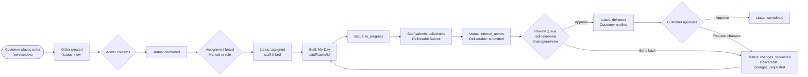
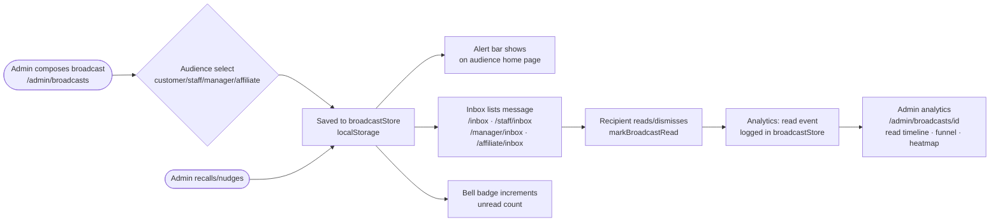
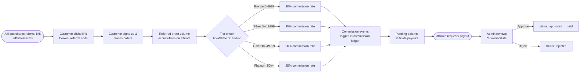
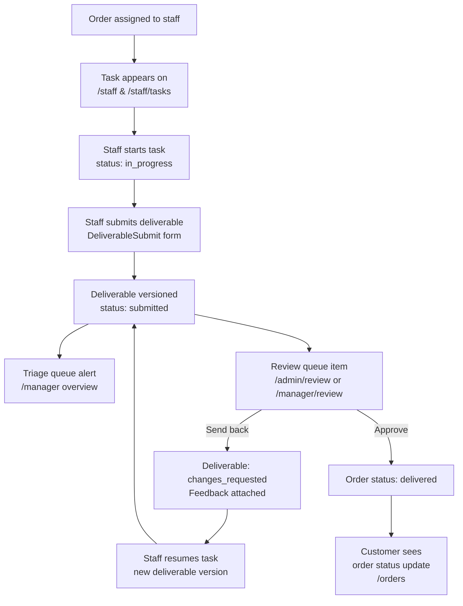

# HevaSEO — Feature Catalog

> **Audience:** Backend engineers, new hires, and product stakeholders.
> **Source of truth:** This document is derived from the Phase-0 mock codebase via the page-crawler audit pipeline (`docs/audit/`). Where the mock fakes a value it is marked **mock — needs backend**.

---

## 1. Overview

HevaSEO is a multi-tenant SEO-services SaaS platform where an agency sells packaged SEO services (keyword research, backlinks, content, audits, optimization, web design, indexing) to business customers. The agency uses an internal ops workforce (staff + managers) to deliver the work. An affiliate/KOL referral program drives customer acquisition.

The platform is a **Next.js 15 App Router** application in Phase-0 (full frontend on mock data; no backend yet). All data lives in module-scope TypeScript constants and `localStorage`; every feature is production-quality UI waiting for real queries.

### The Five Roles

| Role | Area | Purpose |
|---|---|---|
| **Customer** | `/` (root routes) | The paying client — orders services, tracks projects, manages credit, files support tickets, reads docs |
| **Admin** | `/admin/*` | Full ops + business control — orders, assignments, deliverables review, finance, payroll, affiliate program, broadcasts, org settings |
| **Manager** | `/manager/*` | Pod-scoped ops — same ops actions as admin but **money-blind to OTHERS' money** (pod/customer/staff figures) and **no service-catalog access**; can only see/act on their own pod. Exception: their OWN pay (`/manager/finance`) — salary + a % override on the pod's gig/commission. |
| **Staff** | `/staff/*` | Delivery workers — task execution, deliverable submission, personal finance/performance, knowledge base |
| **Affiliate** | `/affiliate/*` | KOL referral partners — refer customers, earn tiered commissions, request payouts |

Total routes: **90** (customer 17, admin 28, manager 21, staff 17, affiliate 7). *(+`/manager/finance` — the manager's own pay.)*

---

## 2. Feature Catalog

Features are grouped by domain. Each entry includes a 1–2 line description and the routes that expose it.

### 2.1 Orders

**Order lifecycle management** — the central entity. An order tracks one service package purchased by a customer through statuses: `new → confirmed → assigned → in_progress → internal_review → delivered → approved/changes_requested → completed`. Cancellation is allowed **only while the order is still "planned"** (see the cancellation policy below).

| Feature | Description | Routes |
|---|---|---|
| Order board / explorer | Multi-view (Kanban, List, Table) order browser with sort, filter, and date-range controls | `/admin/orders`, `/manager/orders`, `/orders` (customer) |
| Order detail | Full order card: status, staff, customer, service/package, deadline, deliverable history, internal notes, customer view | `/admin/orders/[id]`, `/manager/orders/[id]` |
| Customer order view | Customer-facing Kanban/List/Table board scoped to their own orders; drag-to-reorder columns, view toggles persisted to `localStorage` | `/orders` |
| Order creation | New orders placed from the service catalog; quick-create available from the admin command center | `/services/[svc]` (customer), admin command center |
| SLA / deadline tracking | Deadline field on each order; overdue detection and priority signals in triage queues | All order-listing routes |
| **Order cancellation policy** | Cancel is allowed **only while "planned"** — i.e. `new \| confirmed \| assigned`, *before the staff accepts the work*. Once the staff accepts and it moves to `in_progress` ("processing") or beyond, it can no longer be canceled. **Every cancellation withholds a flat 5% fee** of the order value (anti-spam). The refund (95%) is always returned as **dashboard credit** — never a card refund — which also covers **quick-buy customers** (who ordered on the marketing pages): their refund lands as credit in their dashboard, minus the 5%. This is the general policy. *(Backend: `cancel_order` DB fn — `NOT_CANCELABLE` guard + `cancel_fee` ledger entry, ADR D1.)* | `cancel_order` (Phase 1 DB fn) |

### 2.2 Assignment & Routing

**Staff assignment engine** — maps unassigned orders to available staff, either manually or via rule-based auto-routing.

| Feature | Description | Routes |
|---|---|---|
| Assignment board | Drag-and-drop unassigned orders onto staff cards; shows per-staff workload, capacity, and skill match | `/admin/assignment`, `/manager/assignment` |
| Bulk assignment | Select multiple orders and assign to one staff member | `/admin/assignment`, `/manager/assignment` |
| Assignment rule engine | Configurable rules that pin or auto-route an order by service + package to a specific staff member or "auto" mode | `/admin/assignment` (admin-only; rule CRUD) |
| Triage queue | Prioritized action queue: overdue, awaiting-review, changes-requested, SLA-urgent, unrouted — manager's primary work surface | `/manager` (overview) |
| Rebalance suggestion | Detects load imbalance in a pod and suggests moving work from the most-loaded to a skill-compatible lighter staffer | `/manager` (overview) |

### 2.3 Deliverables & Review

**The delivery loop** — staff submit work; admins and managers review; customers approve or request changes.

| Feature | Description | Routes |
|---|---|---|
| Deliverable submission | Staff attach work and submit for review; versioned (v1, v2…) so revision history is preserved | `/staff/tasks/[id]`, `/staff/deliverables` |
| Review queue | All pending deliverables, newest first; filter by staff, service, or "sent back" | `/admin/review`, `/manager/review` |
| Approve / send back | Reviewer approves or sends back with feedback; triggers order status transition | `/admin/review`, `/manager/review` |
| Deliverables list (staff) | Staff-facing list of their own submitted work, with status and feedback | `/staff/deliverables` |
| Task detail (staff) | Full task card: brief, deadline, priority, keyboard shortcuts (j/k/s), state machine actions (Start → Submit → Resume) | `/staff/tasks/[id]` |
| Task history | Completed-task archive per staffer; shows commission earned, rating, on-time flag | `/staff/history/[code]` |

### 2.4 Tickets / Support

**Customer support — multi-channel ticket management.**

| Feature | Description | Routes |
|---|---|---|
| Ticket list & management | Admin/manager view of all open/pending/resolved tickets; sortable, assignable, SLA-tiered | `/admin/tickets`, `/manager/tickets` |
| Customer support portal | Customer creates and tracks their own tickets; SLA info displayed; reply flow | `/support` |
| SLA tracking | Tickets tagged `urgent` or `standard`; urgency breached when age exceeds SLA limit in hours | Ticket views on all ops surfaces |
| Ticket thread | Conversation thread (customer ↔ staff) per ticket | `/support` (customer), `/admin/tickets`, `/manager/tickets` |

### 2.5 Finance & Payroll

**Business-finance is admin-only** (revenue, pod/customer money). Managers are money-blind to OTHERS' money, but **do have their own pay** — see "Manager payroll" + `/manager/finance` below.

| Feature | Description | Routes |
|---|---|---|
| Finance overview | Revenue metrics, payroll summary, cashflow indicators. The KPI band is built by `financeKpis` (`data/adminRevenue.ts`) — **pure**, derived from data the page already fetched, so it issues no queries of its own. "Gross" is *recognized* revenue and "Deposits" is *cash*; they are separate KPIs on purpose. There is deliberately **no accounts-receivable figure** — this business is prepaid, so nobody can owe us. | `/admin/finance` (admin-only) |
| Staff payroll model | **Cycle comp = base salary + gig pay + commission + bonus, then − penalties = net.** `commission = basis × rate%`; `gig pay = Σ delivered gigs × per-gig rate`. Per-gig rate resolves **package rate → service rate → global `GIG_RATE`** (`gigRateOf`/`gigPay` in `lib/payOverrides.ts`). So a staffer can be salaried, paid per gig, or a blend. `data/adminPayroll.ts`'s period explorer nets `base + gig + commission + bonus − penalties`, consistent with `effectivePay` (historical months carry gig = 0 — the mock models gig only for the current cycle). The REAL admin payroll preview is `computePayrollPreview` (`data/adminComp.ts`, pure + unit-tested): from real delivered orders it accrues `base + commission(basis × pct%)` on the ASC 606 basis and reports **`outstanding = accrued − paid`** (from `payroll_runs`), clamped ≥ 0 — "Payouts due" reads `outstanding`, never the gross accrual. | `/admin/finance` |
| **Manager payroll model** | **Manager comp = base salary + an OVERRIDE on what their pod's staff earn** — `gigPct%` of the pod's gig pay + `commPct%` of the pod's commission (defaults 10% / 15%, editable per manager; live from the staff pay rows). NOT tied to order value; managers have **no KPI/delivery bonus**. `ManagerPayout` (`adminMock.ts`): `podGig`/`podCommission`/`gigPct`/`commPct`/`commission`; `effMgrComp` in the admin Payouts tab. | `/admin/finance?tab=payouts` |
| Manager wallet (manager self) | A manager has their OWN wallet + payouts (salary + pod-override commission), seeing **only their own** — money-blind to others. Reuses the staff finance UI with the KPI rewards section hidden (`showRewards={false}`). | `/manager/finance` |
| Per-staff pay overrides | Admin sets a staffer's `base`/`rate`/`bonus`/`gigRates`/`gigPkgRates`; one localStorage source shared by Finance Payouts tab **and** the admin staff profile (`usePayOverride`, `lib/payOverrides.ts`) | `/admin/finance`, `/admin/staff/[id]` |
| Pay presets | Reusable pay templates the admin applies to any staffer to fill the comp form quickly (`usePayPresets`) | `/admin/finance`, `/admin/staff/[id]` |
| Gig price reference | In the staff-profile pay editor, each gig rate shows the customer-facing **sell price** beside it — `servicePriceRange()` per service, `packagePrice()` per package (`lib/gigPricing.ts`, derived from order values) — so admin sees what a gig sells for vs what they pay. Rates support decimals (cent-accurate commission) | `/admin/staff/[id]` |
| Staff wallet (staff self) | Staff see their own commission ledger, pending balance, payout history | `/staff/finance` |
| Payout request (staff) | Staff request withdrawals to a registered payout method; status: requested → approved → paid | `/staff/finance` |
| Penalty system | Auto-flagged (revision rounds, late, rating) and manual penalties; staff can dispute | `/staff/finance`, `/staff/performance` |
| Customer credit & invoices | Credit balance, spend, transaction history, invoices; runway calculation | `/credit` |
| Affiliate finance overview | Admin view of partner tiers, earnings, and payout approvals | `/admin/affiliate` |

#### Custom quotes

Plans the catalog gives a `priceLabel` to — `Consult`, `Custom quote`, and every `from $X` — have no price to charge, only a price to decide. Placing one **charges nothing and creates no order**: it opens a quote request. A specialist prices the job, the customer gets a link, and the order is born only when they accept and pay that amount.

| Feature | Description | Routes |
| --- | --- | --- |
| Request a quote | Customer picks a `priceLabel` plan; nothing is debited, no order exists. The order button reads "Request a quote" | `/services/[svc]` |
| Quote queue | Managers price custom jobs and copy the customer's link. **Tenant-wide, not pod-scoped** — a new lead has no pod yet, so pod-scoping would make every lead invisible | `/manager/quotes` |
| Accept & pay | Customer sees the amount, their balance and what's left before deciding; accepting debits exactly the quoted amount and creates the order | `/quote/[token]` |

**Who may price.** Managers are money-blind by design (no `pricing.view`, no `finance.view`; `orders_mgr` strips `value`). Quoting is pricing, so `quotes.manage` is a deliberate, narrow exception: a manager sets one number on one quote and gains nothing else — not a wallet, not LTV, not revenue, not even the value of the order their own quote becomes.

**The link is not a key.** `/quote/<token>` requires the owning customer to be signed in; RLS returns the row to nobody else, and `accept_quote` re-checks ownership from the JWT before debiting. A forwarded link cannot spend someone else's credit.

**Revenue.** An accepted quote is a *booking*, not revenue — the order starts at `new`, and revenue is recognized on delivery like any other (ASC 606). Deferred revenue is unchanged by the accept: the credit simply becomes undelivered work.

#### Read integrity — why the money numbers can be trusted

PostgREST caps every response at `max_rows` (1000, `supabase/config.toml`) and **does not error when it truncates**: it returns a short array with a 2xx. Code that sums the result is then quietly wrong, forever, with nothing in the logs. Measured against this database: a deliberately truncated 3-of-11 ledger read returned HTTP 206 and summed to `-78.02` instead of `17288.98`.

Every money read is therefore one of two shapes, and `.limit(1000)` is neither — that only makes the truncation intentional.

| Shape | Where | Why |
|---|---|---|
| **Aggregate in SQL** | `revenue_book(p_window_days)` RPC → `getRevenueBook` (`data/adminRevenue.server.ts`) | The whole book — totals, deferred, reconcile, daily series — comes back as one `jsonb`, so the row count stops mattering. Admin-gated (SECURITY DEFINER bypasses RLS). The old Node-side version also had no `ORDER BY`, so the surviving 1,000 rows were arbitrary: wrong *differently* on each load. |
| **Row read + tripwire** | `allRows()` (`lib/supabase/allRows.ts`) — used by `getLedger`, `getCustomerWallets`, `getPayments`, `getAnalytics`, `getSupportStats`, `getGeoStats`, `getPayrollPreview`, `getCustomers`, `getOpenTicketCounts` | Asks for `count: 'exact'` and **throws** if the server holds more rows than it returned. Turns silent under-reporting into a loud failure. A page that crashes is recoverable; a page that quietly under-states revenue is not. |

**The ASC 606 state rules now live in two places** — `RECOGNIZED_STATES`/`isBookedState` in `data/adminRevenue.server.ts` (still needed in TS for the per-service and per-customer breakdowns the RPC doesn't return) and the `recognized`/`unearned` CTEs in the RPC. `adminRevenue.test.ts` pins the TS side and `supabase/tests/0830_revenue_book_test.sql` pins the SQL side against the same documented rule, so drift fails a test instead of quietly making two pages disagree — which is exactly what happened when the catalog was duplicated.

### 2.6 Broadcasts / Messaging

**Admin-to-everyone messaging system** — one-to-many announcements with per-message analytics.

| Feature | Description | Routes |
|---|---|---|
| Compose & send broadcast | Rich text + optional long-form article; target audience(s): customer / staff / manager / affiliate; schedule for later | `/admin/broadcasts` |
| Broadcast management | List, search, recall, duplicate, re-send (nudge), delete broadcasts | `/admin/broadcasts` |
| Broadcast analytics | Per-message read timeline, audience funnel, hour heatmap, read/click counts; CSV export | `/admin/broadcasts/[id]` |
| Alert bar (overview banner) | Live / critical broadcasts show an alert bar on each audience's home page | Audience home pages |
| Inbox (recipient) | Each role surface has an inbox showing broadcasts addressed to them; mark read, dismiss | `/inbox`, `/staff/inbox`, `/manager/inbox`, `/affiliate/inbox` |
| Bell / notification count | Unread broadcast count visible in the sidebar badge | All sidebars |

### 2.7 Docs & Notes

**Knowledge distribution (docs) and private notebooks (notes).**

| Feature | Description | Routes |
|---|---|---|
| Doc authoring | Admin creates docs with rich HTML (sanitized), tags, audience targeting (customer/staff/manager), pinned flag | `/admin/docs/new`, `/admin/docs/[id]/edit` |
| Doc distribution | Audience-gated: a doc reaches only the audiences it was distributed to; staff docs are additionally skill-gated | `docsStore` (shared data layer) |
| Doc library (recipient) | Each surface shows only docs addressed to their audience; staff also see only docs matching their skills | `/docs`, `/staff/docs`, `/manager/docs` |
| Doc reader | Full doc rendered from sanitized HTML; no raw user HTML reaches the DOM | `/docs/[id]`, `/staff/docs/[id]`, `/admin/docs/[id]`, `/manager/docs/[id]` |
| Notes (private notebook) | Per-role private rich-text notebook; sanitized HTML at save; notes are namespaced by surface and never shared across roles | `/notes`, `/staff/notes`, `/manager/notes`, `/admin/notes` (and `/new`, `/[id]`, `/[id]/edit` for each) |

### 2.8 Affiliate / KOL Program

**Tiered referral program — affiliates earn commission on referred customer order volume.**

| Feature | Description | Routes |
|---|---|---|
| Affiliate join / landing | Public landing page with social proof, tier strip, time-boxed offer, and sign-up form | `/affiliate/join` |
| Affiliate overview | Adaptive dashboard: new partner sees onboarding hero; active partner sees commission KPIs, momentum, referral link | `/affiliate` |
| Referral tracking | List of referred customers with volume, status ("active", "churned"); a "slipping away" alert is derived from churned status | `/affiliate/referrals` |
| Commission ledger & payouts | Earnings history, pending balance, payout request form; tier-upside nudge computed from real volume | `/affiliate/payouts` |
| Promotional assets | Creative assets and referral link toolkit; conversion nudge | `/affiliate/assets` |
| Partner settings | Payout method, referral code management | `/affiliate/settings` |
| Admin affiliate management | Directory of all partners; tier override, approve/reject payouts, earnings chart (`programSeries`), partner-level detail | `/admin/affiliate` |

### 2.9 Staff Performance

**Ops-quality metrics for delivery staff and their managers.**

| Feature | Description | Routes |
|---|---|---|
| Staff scorecard | Composite score (0–100) across quality, on-time, throughput; score breakdown; coaching lever; team ranking; reward progress | `/staff/performance` |
| Reward milestones | Milestone unlocks based on composite score; animated progress bars | `/staff/performance` |
| Staff profile (admin/manager) | Deep view: workload, skill breakdown, pay snapshot (admin-only), task history, leave record | `/admin/staff/[id]`, `/manager/staff/[id]` |
| Staff roster | Directory of all staff / pod staff with workload KPIs; add staff (admin); reassign pod (admin) | `/admin/staff`, `/manager/staff` |
| Staff leave queue | Admin approves/declines leave requests; leave latency counted in manager score | `/admin/staff/leave` |
| Manager scorecard | 5-lever composite (delivery, quality, responsiveness, team-health, growth) + coaching action; peer benchmark | `/manager/performance`, `/admin/managers` |
| Manager directory | Admin oversight of all managers; pod summaries, value-in-flight, performance composite | `/admin/managers` |
| Staff insights (hover card) | Rich hover card surfaced in admin views: finance, performance, skill tags, workload — same data as profile | Admin surfaces globally |

### 2.10 Customer Projects & Services

**Customer-facing project and service management.**

| Feature | Description | Routes |
|---|---|---|
| Project management | Create/edit/delete projects and folders; drag-and-drop project into folder; associate orders with a project | `/projects`, `/projects/[id]` |
| Service catalog (customer) | Browse available and coming-soon services; data-driven availability | `/services` |
| Service order | Select a service, pick a package and plan, submit a new order | `/services/[svc]` |
| Dashboard | Order counts, service mix, on-time rate, activity feed, date-range filter | `/dashboard` |

### 2.11 Settings

**Per-role configuration.**

| Feature | Description | Routes |
|---|---|---|
| Customer settings | Profile, billing details, API key, plan selection, password change, 2FA toggle | `/settings` |
| Staff settings | Profile editing, working-hours toggles, time-off entries, handoff policy | `/staff/settings` |
| Manager settings | Name, email, notification prefs; pod-info read-only | `/manager/settings` |
| Affiliate settings | Payout method, referral code | `/affiliate/settings` |
| Org settings (admin) | Org-wide admin configuration; restricted to `org.settings` capability | `/admin/settings` |

### 2.12 Audit Log

**Immutable event log — admin and managers see a filtered view.**

| Feature | Description | Routes |
|---|---|---|
| Audit log (admin) | Full chronological event stream: all entities (order, customer, staff, ticket, deliverable, catalog, auth) with actor, action, diff | `/admin/audit` |
| Audit log (manager) | Pod-scoped view — only events touching this pod's staff, customers, or orders; financial events stripped via `isMoneyEvent()` | `/manager/audit` |

### 2.13 Service Catalog (Admin)

**Admin management of the service product line.**

| Feature | Description | Routes |
|---|---|---|
| Catalog view | Service list with pricing (flat, range, usage-based, custom), packages, and group structure | `/admin/catalog` |
| Catalog management | Edit prices, descriptions, upsells — single source for both the admin view and the customer ordering surface (`@heva/catalog`) | `/admin/catalog` |

### 2.14 Analytics

**Business intelligence — admin-only.**

| Feature | Description | Routes |
|---|---|---|
| Revenue analytics | Revenue chart, service mix by revenue, geographic distribution, top customers by LTV | `/admin/analytics` |
| Audience analytics | Traffic and conversion funnel; channel breakdown | `/admin/analytics` |
| Support stats | Ticket volume, resolution rate, avg first-response time | `/admin/analytics` |
| Team performance overview | Composite summary of team delivery quality | `/admin/analytics` |

### 2.15 Impersonation

**Cross-role administrative tool.**

| Feature | Description | Routes |
|---|---|---|
| Admin → customer impersonation | Admin can view the customer portal as any specific customer; cookie-based; identity banner shown; full `act` mode | `lib/impersonation.ts`; button in customer hover card and `/admin/customers/[id]` |
| Admin/manager → staff impersonation | `act` mode (admin): full access as the staff member. `view` mode (manager): read-only look-in — cannot mutate tasks, notes, or settings | Button in staff list and profile; governed by `useImpersonatePolicy()` |
| Admin → affiliate impersonation | Admin views the `/affiliate` portal as any specific partner; cookie-based (`heva_as_affiliate`); no mode flag — always `act` | "View as partner" button in `PartnerHoverCard` and `PartnerDrawer`; `lib/impersonation.ts` + `lib/currentAffiliate.ts` |

### 2.16 Marketing quick-order & order-email lifecycle

**Self-serve, PAY-FIRST order entry from the marketing site (`apps/web`, Astro) backed by a trusted checkout endpoint in `apps/app`.** A visitor with no dashboard account can buy a service end-to-end; the order only reaches the backend **after a successful charge**. **Implemented Phase 2** (mock payment gateway — real Stripe drops in behind the same seam). Email auto-send is the remaining Phase-2 piece; today the dashboard login + temp password are shown on the confirmation card instead.

| Feature | Description | Routes / Source |
|---|---|---|
| Marketing quick-order | Pick a service package (7 services: keyword-research, audit, website-optimization, seo-web-design, backlink, content, indexer; flat/bulk/usage pricing), fill the brief + contact, choose upsell add-ons. Catalog is the **single source** shared with the dashboard. **DONE.** | `apps/web` `/order/[slug]`, **`@heva/catalog/orders`**, `components/order/*` |
| Pay-first 2-step flow | "Continue to payment" → dedicated payment screen (3-col: **step rail · payment form · order-details panel**); nothing is charged until the user pays. On success the centre swaps to an inline **"Order received"** card (confetti) and the rail advances (Pay ✓ → Delivered "Coming soon"). **DONE.** | `OrderShell.astro` |
| Public checkout — the 6 chốt | Trusted server endpoint: ① **server-side price** (`priceQuickOrder`, client total never trusted) · ② rate-limit (in-mem) + Turnstile (*stub — needs key*) · ③ **idempotent** by `orders.checkout_ref` · ④ **temp-password** account · ⑤ **email-collision guard** (claimed account → attach order, no re-create / no auto-login) · ⑥ reconcile (*Stripe-only, deferred*). **DONE (mock).** | `POST /api/public/checkout` (apps/app) |
| Payment provider seam | Card charge behind a `PaymentProvider` interface — **MockProvider** now (any card passes; an amount ending `.99` = simulated decline); a real **StripeProvider** drops in later behind the same endpoint, no UI change. | `lib/payments/provider.ts` |
| `materialize_order` (atomic) | One transaction: topup the exact value **+** create the order (`source = quick`) **+** debit — never sells credit without an order; idempotent by `checkout_ref`. service-role-only. | `materialize_order` DB fn (migration `20260630150000`) |
| Account provisioning on checkout | New/shadow email → service-role `auth.admin.createUser` (temp password) → `handle_new_user` trigger makes the profile; the route find/creates + links the `customers` row. The new login + **temp password** appear on the confirmation card *(email send = Phase 2)*. | route handler + `handle_new_user` |
| Billing save | Buyer can opt-in to save billing (name/company/address/city/postal/country) to **`customers.billing`** so the dashboard prefills it next time. | `customers.billing` jsonb (migration `20260630170000`) |
| Order details panel | The payment + confirmation screens show the chosen plan + **what it includes** (features), each **upsell add-on + price**, and the total due. | `OrderShell.astro` |
| Transactional order emails | *(Phase 2, not built)* auto-send on checkout / **order accepted** / **completed (+report)**; customer may receive the report by email instead of the dashboard. | `email_log`, DB fn `send_order_email(order, event)` |
| Admin email templates | Admin creates/edits the email templates (subject/body/variables); the system fills + auto-sends them per event | `EmailTemplate` in `AdminSettings.email[]`, `/admin/settings` |

---

## 3. Feature ↔ Role Matrix

`✓` = full access · `view` = read-only · `—` = not applicable · `✗` = blocked by RBAC

> **Manager money-blind rule:** The manager role does NOT hold `finance.view`, `analytics.view`, `pricing.view`, `catalog.view`, `affiliate.manage`, `managers.manage`, or `org.settings`. All monetary figures (order value, customer LTV/spend, staff pay, revenue) are masked to `—` for manager viewers by four independent layers: the RBAC capability matrix (`lib/rbac.ts`), `ViewerProvider`/`useMoney()`/`useShowMoney()` hooks, explicit `showMoney={false}` server-component props, and pod-scoped data derivation in `managerPulse`/`managerPerf` that never reads monetary fields.

> **Staff view / act impersonation distinction:** When a manager enters the staff portal as "View as" (`view` mode), they are read-only across all staff pages. `useStaffViewOnly()` is enforced on `/staff/finance` (`ViewOnlyGuard`), `/staff/tasks/[id]` (`TaskDetailClient`), `/staff/notes` (`NotesClient`, `NoteFullEditor`), and `/staff/settings` (`SettingsClient`) — controls are disabled and their handlers short-circuit. `act` mode (admin only) grants full mutation rights.

| Capability / Feature | Customer | Admin | Manager | Staff | Affiliate |
|---|---|---|---|---|---|
| **Orders — view own** | ✓ | — | — | — | — |
| **Orders — view all** | ✗ | ✓ | ✓ (pod-scoped) | ✗ | ✗ |
| **Orders — view value/pricing** | ✓ (own) | ✓ | ✗ (money-blind) | ✗ | ✗ |
| **Assignment board** | ✗ | ✓ | ✓ (pod-scoped) | ✗ | ✗ |
| **Assignment rules (CRUD)** | ✗ | ✓ | ✗ | ✗ | ✗ |
| **Deliverable submission** | ✗ | ✗ | ✗ | ✓ | ✗ |
| **Deliverable review (approve/send back)** | ✗ | ✓ | ✓ (pod-scoped) | ✗ | ✗ |
| **Tickets — own only** | ✓ | — | — | — | — |
| **Tickets — all / pod** | ✗ | ✓ | ✓ (pod-scoped) | ✗ | ✗ |
| **Finance — revenue / payroll / cashflow** | ✗ | ✓ | ✗ | ✗ | ✗ |
| **Finance — own earnings (staff)** | ✗ | ✗ | ✗ | ✓ | — |
| **Finance — payout request (staff)** | ✗ | ✗ | ✗ | ✓ | — |
| **Credit & invoices (own)** | ✓ | — | — | — | — |
| **Credit adjustment** | ✗ | ✓ | ✗ | ✗ | ✗ |
| **Broadcasts — compose/send/recall** | ✗ | ✓ | ✗ | ✗ | ✗ |
| **Inbox (receive broadcasts)** | ✓ | — | ✓ | ✓ | ✓ |
| **Docs — author & distribute** | ✗ | ✓ | ✗ | ✗ | ✗ |
| **Docs — read (audience-gated)** | ✓ (customer audience) | ✓ (all) | ✓ (manager audience) | ✓ (staff + skill-gated) | — |
| **Notes (private notebook)** | ✓ | ✓ | ✓ | ✓ | — |
| **Staff roster — view** | ✗ | ✓ | ✓ (pod-scoped) | ✗ | ✗ |
| **Staff roster — manage (add/edit/remove)** | ✗ | ✓ | ✗ | ✗ | ✗ |
| **Staff finance (others')** | ✗ | ✓ | ✗ | ✗ | ✗ |
| **Staff leave — approve/decline** | ✗ | ✓ | ✓ (pod-scoped) | ✗ | ✗ |
| **Manager directory** | ✗ | ✓ | ✗ | ✗ | ✗ |
| **Manager performance** | ✗ | ✓ | ✓ (own pod) | ✗ | ✗ |
| **Customer directory** | ✗ | ✓ | ✓ (pod-scoped) | ✗ | ✗ |
| **Customer impersonation** | ✗ | ✓ | ✗ | ✗ | ✗ |
| **Staff impersonation (act)** | ✗ | ✓ | ✗ | ✗ | ✗ |
| **Staff impersonation (view-only)** | ✗ | ✓ | ✓ | ✗ | ✗ |
| **Affiliate impersonation** | ✗ | ✓ | ✗ | ✗ | ✗ |
| **Catalog — view** | ✓ (service menu) | ✓ | ✗ | ✗ | ✗ |
| **Catalog — manage (edit prices)** | ✗ | ✓ | ✗ | ✗ | ✗ |
| **Analytics (revenue/audience)** | ✗ | ✓ | ✗ | ✗ | ✗ |
| **Audit log** | ✗ | ✓ | ✓ (pod-scoped, money-stripped) | ✗ | ✗ |
| **Org settings** | ✗ | ✓ | ✗ | ✗ | ✗ |
| **Affiliate program — manage** | ✗ | ✓ | ✗ | ✗ | — |
| **Affiliate portal (own)** | ✗ | ✗ | ✗ | ✗ | ✓ |
| **Projects** | ✓ | ✗ | ✗ | ✗ | ✗ |
| **My Day / task board (staff)** | ✗ | ✗ | ✗ | ✓ | ✗ |
| **Staff calendar** | ✗ | ✗ | ✗ | ✓ | ✗ |
| **Staff performance / rewards** | ✗ | view (via profile) | view (pod-scoped) | ✓ | ✗ |
| **Penalty management** | ✗ | ✓ | ✗ | view (own) | ✗ |

---

## 4. Feature ↔ Feature Flows

### 4.1 Order Lifecycle



### 4.2 Broadcast → Inbox → Bell



### 4.3 Affiliate Referral → Commission → Payout



### 4.4 Staff Task → Deliverable → Review → Customer



### 4.5 Docs Distribution

```mermaid
flowchart LR
    A([Admin authors doc\n/admin/docs/new]) --> B[sanitizeHtml at save\nlib/sanitizeHtml.ts]
    B --> C[Doc stored in docsStore\nwith audiences array]
    C --> D{Audience gate\ndocsForCustomer\ndocsForStaff\ndocsForManager}
    D -->|audiences: customer| E[/docs customer library]
    D -->|audiences: staff + skills| F[/staff/docs\nskill-gated]
    D -->|audiences: manager| G[/manager/docs\nmanager library]
    D -->|all| H[/admin/docs\nadmin sees all]
```

### 4.6 Marketing quick-order checkout (pay-first)

How a marketing visitor becomes a paying customer with a dashboard account, end-to-end:

```mermaid
flowchart TD
    A([Visitor on apps/web /order/slug]) --> B[Pick package + add-ons + brief + email]
    B --> C[Continue to payment]
    C --> D[Payment screen: 3-col\nstep rail · card/billing · order details]
    D --> E[Pay $X — mock gateway]
    E --> F{POST /api/public/checkout\napps/app, the 6 chốt}
    F --> G[priceQuickOrder server-side\nclient total ignored]
    G --> H[getPaymentProvider.charge\nmock now / Stripe later]
    H -->|declined| D
    H -->|ok| I{account by email}
    I -->|new / shadow| J[auth.admin.createUser\ntemp password → trigger makes profile]
    I -->|already claimed| K[attach order, no re-create]
    J --> L[materialize_order ATOMIC\ntopup + order(quick) + debit\nidempotent by checkout_ref]
    K --> L
    L --> M[save customers.billing if opted-in]
    M --> N([Order received card + confetti\nrail → Pay done, Delivered 'coming soon'])
    N --> O[New acct: login + temp password shown\nemail send = Phase 2]
```

**Operational notes:** the order is created **only after a successful charge** (no honeypot/lead-gate — payment is the gate). Price is always recomputed server-side from the shared `@heva/catalog/orders` (the marketing site and the endpoint share one source). `materialize_order` is one transaction so credit is never sold without an order; a retried payment (same `checkout_ref`) returns the same order. Swapping in real Stripe = a `StripeProvider` behind the same endpoint + a webhook calling the same `materialize_order` (+ the reconcile job, chốt ⑥). Refunds on cancel follow the general 5% policy (§2.1) → credit.

---

## 5. Feature ↔ Data Map

> "mock — needs backend" flags values that are currently hardcoded constants, module-scope singletons, or `localStorage` — not derived from a real database query.

| Feature | Lib / Data Module(s) | Backend note |
|---|---|---|
| **Order list** | `data/adminMock.ts` → `ORDERS[]` | mock — needs backend: DB table with `status`, `staffId`, `customerId`, `deadline` |
| **Order detail** | `lib/orderDetail.ts` → `buildOrderDetailProps` | mock — needs backend |
| **Order creation (customer)** | `data/services.ts` → `SERVICE_CATALOG`; `components/OrdersStore.tsx` | `OrdersStore` is in-memory React context; needs `POST /orders` |
| **Assignment board** | `data/adminMock.ts` → `ORDERS`, `STAFF`, `RULES`; `admin/assignment/build.ts` | `RULES` array → assignment-rule table; `seqMap` must be per-request |
| **Assignment rule engine** | `data/adminMock.ts` → `RULES[]` | mock — needs backend |
| **Deliverable submission** | `data/staffMock.ts` → `DELIVERABLES[]`; `data/adminMock.ts` → `DELIVERABLES` | mock — needs backend: versioned deliverable with `orderId`, `staffId`, `submittedAt`, `status` |
| **Review queue** | `admin/review/build.ts` → `buildReviewProps`; `data/adminMock.ts` → `DELIVERABLES` | mock — needs backend |
| **Ticket management** | `data/adminMock.ts` → `TICKETS[]` | mock — needs backend: SLA timer computed server-side |
| **Customer support** | `components/SupportClient.tsx`; `data/adminMock.ts` → `SEED_TICKETS` | mock — needs backend: scoped to `customerId`, real thread persistence |
| **Admin finance / payroll** | `data/adminMock.ts` → `REVENUE_*`, `OPS_KPIS`, `GIG_RATE`/`gigRateFor`; `data/adminPayroll.ts` (period explorer); `lib/payOverrides.ts` (`effectivePay`, `gigPay`, overrides + presets) | mock — needs backend: revenue/payroll from real transactions; pay overrides/presets are localStorage → must become tables |
| **Staff finance (own)** | `lib/staffFinance.ts` (types + math); `data/staffMock.ts` (earnings, wallet, penalties, payouts) | mock — needs backend: `StaffEarnings`, `WalletEntry`, `StaffPenalty`, `PayoutRequest`, `PayOverride`, `PayPreset` tables |
| **Gig sell price** | `lib/gigPricing.ts` → `packagePrice`, `servicePriceRange` (derived from `ORDERS` values) | mock — needs backend: list price from the real catalog / transactions, not max-order-value |
| **Customer credit & invoices** | `components/CreditStore.tsx` (in-memory context); `data/mock.ts` → `INVOICES`, `CREDIT_BALANCE` | mock — needs backend: `CreditAccount`, `Invoice` tables scoped to `customerId` |
| **Broadcasts — compose/send** | `data/broadcastStore.ts` (localStorage); `data/broadcasts.ts` → `BROADCAST_SEEDS` | mock — needs backend: `Broadcast` table + recipient event log |
| **Broadcasts — inbox / analytics** | `data/broadcastStore.ts`; `lib/broadcastAnalytics.ts`; `lib/broadcastAudience.ts` | mock — read/click events in localStorage; needs `BroadcastEvent` table |
| **Docs — authoring & storage** | `data/docsStore.ts` (localStorage); `lib/sanitizeHtml.ts` | mock — needs backend: `Doc` table with `audiences[]`, `requiredSkills[]`, RLS |
| **Docs — audience gate** | `data/staffDocs.ts` → `docsForCustomer`, `docsForStaff`, `docsForManager` | mock — needs backend: DB query with audience filter |
| **Staff docs — skill gate** | `data/staffDocs.ts` → `docsForStaff(skills)` | mock — needs backend |
| **Notes** | `data/notesStore.ts` (localStorage, namespaced by surface); `data/staffNotes.ts` → `SEED_NOTES` | mock — needs backend: `Note` table per `userId`, `surface` |
| **Affiliate tiers & commission math** | `lib/affiliate.ts` → `AFFILIATE_TIERS`, `tierFor`, `commissionFor`, `nextTierProgress` | Pure math lib — correct; needs backend data source |
| **Affiliate portal data** | `data/affiliatePortal.ts` → `portalDataFor(id)`; `data/affiliateMock.ts` | mock — needs backend: `Affiliate`, `Referral`, `CommissionEvent`, `Payout` tables |
| **Admin affiliate management** | `data/adminAffiliate.ts` → `adminAffiliates()`, `adminPayouts()`; `data/affiliatePulse.ts` → `programStats()` | mock — needs backend; `programStats()` is a per-call function (not frozen); note `joinOffer()` IS called at module scope in `affiliate/join/page.tsx` → freezes at server start |
| **Staff performance scorecard** | `lib/staff.ts` → `SCORE_MODEL`, `scoreBreakdown`, `improvementLever`, `commissionTierFor`; `data/staffMock.ts` | mock — `TODAY` now single-sourced from `lib/today.ts` (`MOCK_TODAY`); swap to a request-time clock there at backend |
| **Staff rewards** | `lib/staffRewards.ts`; `data/staffMock.ts` | mock — needs backend milestone tracking |
| **Manager scorecard** | `lib/managerPerf.ts` → `allManagerPerf`, `buildManagerPerf`, `companyBenchmark`, `MGR_SCORE_MODEL` | Pure derivation; correct; needs live ops data |
| **Manager triage / pod signals** | `lib/managerPulse.ts` → `triageForPod`, `weekDeadlines`, `qaHealth`, `slaHealth`, `serviceMix`, `rosterWithRebalance`, `recentActivity` | Pure derivation; correct; depends on live `ORDERS`, `DELIVERABLES`, `TICKETS` |
| **Manager pod scoping** | `lib/managerScope.ts` → `managerScope`, `ordersForPod`, `customersForPod`, `ticketsForPod`, `auditInPod` | `MANAGER_PERSONA = 'mgr1'` constant → replace with session manager id |
| **RBAC / capability gate** | `lib/rbac.ts` → `ROLE_CAPABILITIES`, `can()`, `canAccessPath()`, `filterNav()` | UI-layer only; DB RLS is the real gate in Phase-3 |
| **Impersonation** | `lib/impersonation.ts`; `lib/currentStaff.ts`; `lib/currentAffiliate.ts` | Three cookie-based modes: staff (`heva_as` + `heva_as_mode`), customer (`heva_as_customer`), affiliate (`heva_as_affiliate`); `currentAffiliate.ts` scopes the `/affiliate` portal to the impersonated partner; needs session/auth |
| **Staff availability** | `lib/availability.ts`; `data/staffMock.ts` → `MY_AVAILABILITY` | mock — module-scope singleton, not keyed to `staffId` |
| **Staff settings** | `lib/staffSettings.ts`; `data/staffMock.ts` | mock — in-memory |
| **Projects & folders** | `components/ProjectsStore.tsx` (in-memory React context); `data/mock.ts` → `PROJECTS` | mock — needs backend: `Project`, `Folder` tables |
| **Customer dashboard KPIs** | `components/DashboardTop.tsx`; `data/mock.ts` → `ACTIVITY` | mock — `TODAY` computed via `useMemo` (fixed); on-time rate deferred (shows `—`, awaiting backend completion data) |
| **Audit log** | `data/adminMock.ts` → `AUDIT[]` | mock — needs backend: append-only event log, indexed by entity/actor/time |
| **Service catalog (customer)** | `data/services.ts` → `SERVICES`, `SERVICE_CATALOG`; `@heva/catalog` (shared) | mock — `SERVICE_CATALOG` is a static map; needs backend for live pricing/availability |
| **Catalog (admin)** | `data/services.ts`; `admin/catalog/page.tsx` | mock — needs backend: price/package CRUD |
| **Analytics** | `data/adminMock.ts` → `REVENUE_*`, `USER_STATS`, `TICKET_STATS`; `admin/analytics/page.tsx` | mock — all constants; needs real aggregation queries |
| **Leave requests** | `data/adminMock.ts` → `LEAVE_REQUESTS[]` | mock — needs backend |
| **HTML sanitization (all surfaces)** | `lib/sanitizeHtml.ts` | Production-ready: DOMParser-based allowlist; no changes needed |

---

## 6. Known Mock Gaps (Phase-3 Backlog)

The following are the most impactful gaps between the Phase-0 mock and a production backend, sourced from the audit:

### HIGH — RBAC / correctness
1. ~~Staff view-only guards incomplete~~ **✅ RESOLVED** — `useStaffViewOnly()` now gates task actions (`TaskDetailClient`), notes CRUD (`NotesClient`, `NoteFullEditor`), and settings (`SettingsClient`), matching `/staff/finance`.

### HIGH — Data correctness
2. ~~Customer dashboard frozen/fake~~ **✅ RESOLVED** — `TODAY` now computed via `useMemo`; the fabricated on-time % was removed (shows `—` with a backend TODO).
3. **Customer `localhost:4330` support FAQ links** — 404 outside dev.
4. **Staff notes seeded into customer notebook** — `notesStore` seeds `SEED_NOTES` (staff content) on a new customer's first visit.

### MEDIUM — Systemic
5. **15+ hardcoded `TODAY` / month-anchor strings** across all surfaces — diverge from `MOCK_TODAY` and will produce wrong date math in production.
6. **Module-scope data singletons** — `STAFF_NOTIFICATIONS`, `MY_AVAILABILITY` (keyed to the demo persona) and the module-scope `joinOffer()` call in `affiliate/join/page.tsx` freeze at server start; impersonation shows the wrong person's data. (`programStats()` itself is a per-call function — not frozen.)
7. **Financial fields in manager hydration payload** — order value, customer LTV/credit, and staff pay travel to the manager client in the RSC payload even though they are never rendered. Strip at the data layer before Phase-3.
8. **`notFound()` missing** on `/admin/docs/[id]/edit` and `/admin/notes/[id]/edit` (and customer/manager equivalents) — blank editor instead of 404.

### LOW
9. **`metadata` exports missing** — 0/17 staff pages, 0/20 manager pages, 27/28 admin pages, 6 customer routes have no browser-tab title.
10. **`aria-hidden` missing on decorative icons** — `<i className="ph-…">` throughout every surface.
11. **Bare inbox pages** — `/affiliate/inbox` and `/manager/inbox` render `<InboxClient/>` with no `PageHeader` or `metadata`.

---

*Generated by the Phase-2 docs step of the page-crawler pipeline. Source: `docs/audit/INDEX.md` + per-surface audits + `lib/rbac.ts` + nav configs.*
