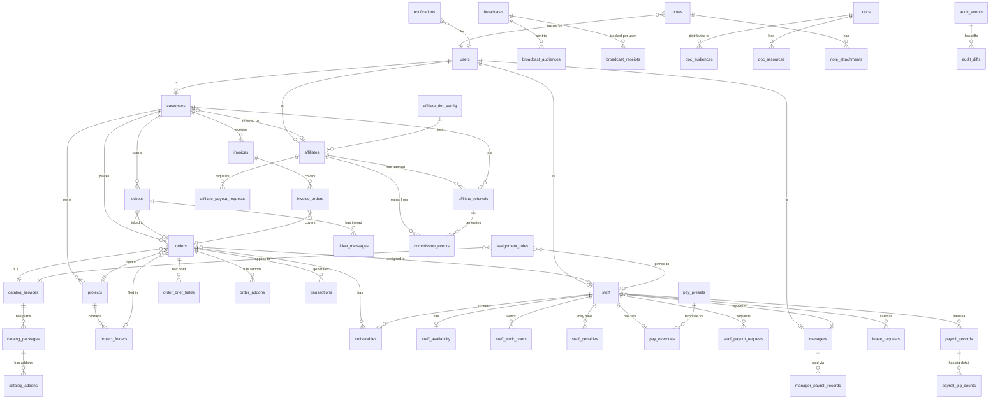

# HevaSEO — Postgres Schema Reference

Concrete DDL for every entity in `docs/DATA-MODEL.md`. Migration-ready: each block can become
a Supabase migration (`supabase/migrations/YYYYMMDDHHMMSS_<domain>.sql`).

---

## Conventions

| Topic | Convention |
|---|---|
| PKs | `uuid DEFAULT gen_random_uuid()` on user-identity tables; `text` PKs preserved from mock IDs (`c1`, `s1`, `o1`, `af-jane`, …) for seed continuity; they become opaque strings in prod |
| Money | `numeric(12,2)` everywhere — **never** `float` or `double precision` |
| Timestamps | `timestamptz` for instant in time; `date` for calendar day |
| Enums | Postgres `CREATE TYPE … AS ENUM` — fail fast on invalid values; cheaper to `ALTER TYPE ADD VALUE` than to migrate a `text` column with a check |
| Soft-delete | Tables where the mock has `active bool` or `status` with a "deactivated" value use that flag; no separate `deleted_at` unless the mock implied it |
| Audit trigger | Every table with user-writeable rows should emit to `audit_events`; wired by a trigger template in the migration tooling, not repeated per table here |
| `updated_at` | Added to every mutable table; maintained by a `moddatetime` trigger |
| `created_at` | `DEFAULT now()` on every table |
| `jsonb` columns | Marked explicitly below; used only for genuinely-flexible payloads (dynamic maps, structured blocks, arbitrary audit metadata, settings trees) |

---

## 1. Enums

Sourced verbatim from string-literal union types in `adminMock.ts`, `staffMock.ts`,
`staffFinance.ts`, `affiliate.ts`, `adminAffiliate.ts`, `broadcasts.ts`, `staffDocs.ts`,
`staffNotes.ts`, `mock.ts`, `services.ts`, and `rbac.ts`.

```sql
-- ── Identity ───────────────────────────────────────────────────────────────────
-- Includes 'affiliate' as the 5th role (see §5a for rationale).
CREATE TYPE role_enum          AS ENUM ('admin','manager','staff','customer','affiliate');
CREATE TYPE user_status_enum   AS ENUM ('active','invited','disabled');

-- ── Orders ─────────────────────────────────────────────────────────────────────
CREATE TYPE order_status       AS ENUM (
  'new','confirmed','assigned','in_progress','internal_review',
  'delivered','changes_requested','approved','completed','canceled'
);
CREATE TYPE priority_enum      AS ENUM ('low','med','high');
CREATE TYPE order_source_enum  AS ENUM ('quick','dashboard');

-- ── Customer ───────────────────────────────────────────────────────────────────
CREATE TYPE customer_status    AS ENUM ('shadow','claimed');
CREATE TYPE customer_tier      AS ENUM ('new','silver','gold','vip');

-- ── Projects ───────────────────────────────────────────────────────────────────
CREATE TYPE project_status     AS ENUM ('progress','completed','planned');

-- ── Catalog / Assignment ───────────────────────────────────────────────────────
CREATE TYPE assignment_mode    AS ENUM ('pin','auto');
CREATE TYPE deliverable_kind   AS ENUM ('file','link');
CREATE TYPE deliverable_status AS ENUM ('submitted','approved','changes_requested');

-- ── Staff availability ─────────────────────────────────────────────────────────
CREATE TYPE avail_status       AS ENUM ('available','away','focus');
CREATE TYPE handoff_policy     AS ENUM ('speed','continuity','balanced');

-- ── Leave ──────────────────────────────────────────────────────────────────────
CREATE TYPE leave_status       AS ENUM ('pending','approved','declined');

-- ── Tickets ────────────────────────────────────────────────────────────────────
CREATE TYPE ticket_type        AS ENUM ('technical','billing','consultation');
CREATE TYPE ticket_channel     AS ENUM ('portal','whatsapp','messenger','email');
CREATE TYPE ticket_status      AS ENUM ('open','pending','resolved','closed');
CREATE TYPE sla_tier           AS ENUM ('urgent','standard');

-- ── Finance / Transactions ─────────────────────────────────────────────────────
CREATE TYPE tx_kind            AS ENUM ('top_up','charge','refund','payout','adjustment');
CREATE TYPE tx_method          AS ENUM ('stripe','paypal','wallet','manual');
CREATE TYPE tx_status          AS ENUM ('settled','pending','failed');
CREATE TYPE invoice_status     AS ENUM ('paid','due','overdue');

-- ── Staff finance ──────────────────────────────────────────────────────────────
CREATE TYPE penalty_type       AS ENUM ('revision','late','rating','manual');
CREATE TYPE penalty_sizing     AS ENUM ('pct','flat','progressive');
CREATE TYPE penalty_status     AS ENUM ('pending','applied','waived','disputed');
CREATE TYPE payout_method_kind AS ENUM ('bank','paypal','wise');
CREATE TYPE payout_status      AS ENUM ('requested','approved','paid','rejected');
CREATE TYPE wallet_entry_kind  AS ENUM ('commission','bonus','penalty','payout');

-- ── Affiliate ──────────────────────────────────────────────────────────────────
CREATE TYPE partner_status     AS ENUM ('active','pending','suspended');
CREATE TYPE commission_status  AS ENUM ('pending','cleared','paid');
CREATE TYPE affiliate_tier_id  AS ENUM ('bronze','silver','gold','platinum');
CREATE TYPE approval_mode      AS ENUM ('instant','manual');
CREATE TYPE attribution_model  AS ENUM ('lifetime','window');
-- affiliate payout methods differ from staff (crypto supported):
CREATE TYPE affiliate_payout_kind AS ENUM ('paypal','bank','crypto');
CREATE TYPE referral_status    AS ENUM ('active','churned');

-- ── Messaging / Docs ───────────────────────────────────────────────────────────
CREATE TYPE broadcast_kind     AS ENUM ('congrats','notice','info','warning','maintenance','outage');
CREATE TYPE broadcast_audience AS ENUM ('customer','staff','manager','affiliate');
CREATE TYPE doc_format         AS ENUM ('guide','sop','checklist','template','policy','video');
-- 'keyword','backlink','content','optimize' map to SERVICE_SKILL keys:
CREATE TYPE doc_audience       AS ENUM ('keyword','backlink','content','optimize','general','manager','customer');
CREATE TYPE note_color         AS ENUM ('default','amber','sky','emerald','violet','rose');
CREATE TYPE note_attachment_kind AS ENUM ('image','video','link','file');
-- 'file' added to match SelfNoteAttachmentKind in staffMock.ts

-- ── Marketing assets ───────────────────────────────────────────────────────────
CREATE TYPE asset_kind         AS ENUM ('banner','social','copy');

-- ── Audit ──────────────────────────────────────────────────────────────────────
CREATE TYPE audit_category     AS ENUM ('create','update','transition','assign','destructive','auth');
CREATE TYPE audit_entity       AS ENUM ('order','customer','staff','rule','ticket','deliverable','catalog','auth');

-- ── Notifications ──────────────────────────────────────────────────────────────
CREATE TYPE staff_notif_kind   AS ENUM (
  'assignment','changes','reminder','approved',
  'penalty','bonus','tier','salary','payout','leave','message'
);
```

---

## 2. Identity Tables

### 2.1 users

Supabase Auth owns `auth.users`. This mirror table stores application-level fields and role.
Linked via trigger: `INSERT INTO public.users … ON auth.users INSERT`.

```sql
CREATE TABLE users (
  id             uuid PRIMARY KEY REFERENCES auth.users(id) ON DELETE CASCADE,
  email          text UNIQUE NOT NULL,
  name           text NOT NULL,
  role           role_enum NOT NULL,
  status         user_status_enum NOT NULL DEFAULT 'active',
  two_fa_enabled bool NOT NULL DEFAULT false,
  created_at     timestamptz NOT NULL DEFAULT now(),
  last_active_at timestamptz,
  updated_at     timestamptz NOT NULL DEFAULT now()
);

CREATE INDEX users_role_idx    ON users(role);
CREATE INDEX users_status_idx  ON users(status);
```

---

## 3. Customer Domain

### 3.1 customers

`referrer_id` is a forward reference to `affiliates` — create it after affiliates, or add FK
via `ALTER TABLE` in a later migration.

```sql
CREATE TABLE customers (
  id             text PRIMARY KEY,                    -- 'c1'..'c11' in seed
  user_id        uuid REFERENCES users(id),           -- NULL when status='shadow'
  name           text NOT NULL,
  company        text NOT NULL DEFAULT '',
  email          text NOT NULL,
  status         customer_status NOT NULL DEFAULT 'shadow',
  tier           customer_tier NOT NULL DEFAULT 'new',
  spend          numeric(12,2) NOT NULL DEFAULT 0
                 CONSTRAINT customers_spend_nonneg CHECK (spend >= 0),
  balance        numeric(12,2) NOT NULL DEFAULT 0,
  phone          text,
  timezone       text,                                -- IANA tz string
  member_since   date,
  tags           text[] NOT NULL DEFAULT '{}',
  referrer_id    text REFERENCES affiliates(id),
  last_active_at date,
  created_at     timestamptz NOT NULL DEFAULT now(),
  updated_at     timestamptz NOT NULL DEFAULT now()
);

CREATE INDEX customers_user_id_idx    ON customers(user_id);
CREATE INDEX customers_tier_idx       ON customers(tier);
CREATE INDEX customers_referrer_idx   ON customers(referrer_id);
CREATE INDEX customers_status_idx     ON customers(status);
```

> `tier` is stored (not derived on read) for fast filtering; a trigger recalculates it when
> `spend` changes: `new < 500 ≤ silver < 1500 ≤ gold < 3000 ≤ vip` (thresholds from mock data).

### 3.2 projects

```sql
CREATE TABLE projects (
  id          text PRIMARY KEY,
  customer_id text NOT NULL REFERENCES customers(id),
  name        text NOT NULL,
  site        text,
  status      project_status NOT NULL DEFAULT 'progress',
  note        text,
  label       text,
  created_at  timestamptz NOT NULL DEFAULT now(),
  updated_at  timestamptz NOT NULL DEFAULT now()
);

CREATE INDEX projects_customer_idx ON projects(customer_id);
```

### 3.3 project_folders

```sql
CREATE TABLE project_folders (
  id         text PRIMARY KEY,
  project_id text NOT NULL REFERENCES projects(id) ON DELETE CASCADE,
  name       text NOT NULL
);

CREATE INDEX project_folders_project_idx ON project_folders(project_id);
```

---

## 4. Catalog Domain

### 4.1 catalog_services

```sql
CREATE TABLE catalog_services (
  id          text PRIMARY KEY,   -- ServiceKey: 'backlink'|'content'|'indexer'|'audit'|'optimize'|'keyword'|'design'
  name        text NOT NULL,
  skill_id    text NOT NULL,      -- maps to SKILL_META key
  tagline     text,
  hero        text,
  order_title text,
  created_at  timestamptz NOT NULL DEFAULT now(),
  updated_at  timestamptz NOT NULL DEFAULT now()
);
```

### 4.2 catalog_groups

```sql
CREATE TABLE catalog_groups (
  id         text PRIMARY KEY,
  service_id text NOT NULL REFERENCES catalog_services(id),
  name       text NOT NULL
);
```

### 4.3 catalog_packages

`gig_rate` is the global staff piece-rate for (service, package); overridden per-staff via
`pay_overrides.gig_rates` (jsonb).

```sql
CREATE TABLE catalog_packages (
  id          text PRIMARY KEY,
  service_id  text NOT NULL REFERENCES catalog_services(id),
  group_id    text REFERENCES catalog_groups(id),
  name        text NOT NULL,
  price       numeric(12,2) NOT NULL DEFAULT 0,
  price_label text,                                 -- 'Get a quote' when set
  sla         text,
  popular     bool NOT NULL DEFAULT false,
  summary     text,
  features    text[] NOT NULL DEFAULT '{}',
  gig_rate    numeric(12,2) NOT NULL DEFAULT 3,     -- global piece-rate USD
  created_at  timestamptz NOT NULL DEFAULT now(),
  updated_at  timestamptz NOT NULL DEFAULT now()
);

CREATE INDEX catalog_packages_service_idx ON catalog_packages(service_id);
```

### 4.4 catalog_addons

```sql
CREATE TABLE catalog_addons (
  id         text PRIMARY KEY,
  service_id text REFERENCES catalog_services(id),
  name       text NOT NULL,
  tier       text,
  price      numeric(12,2) NOT NULL DEFAULT 0
);
```

---

## 5. Order Domain

### 5.1 orders

```sql
CREATE TABLE orders (
  id          text PRIMARY KEY,
  code        text UNIQUE NOT NULL,               -- 'AUD-1001'
  customer_id text NOT NULL REFERENCES customers(id),
  service_id  text NOT NULL REFERENCES catalog_services(id),
  pkg         text NOT NULL,                      -- package name at order time (denormalized)
  value       numeric(12,2) NOT NULL
              CONSTRAINT orders_value_pos CHECK (value >= 0),
  status      order_status NOT NULL DEFAULT 'new',
  priority    priority_enum NOT NULL DEFAULT 'med',
  source      order_source_enum NOT NULL DEFAULT 'dashboard',
  staff_id    text REFERENCES staff(id),
  deadline    date,
  created_at  timestamptz NOT NULL DEFAULT now(),
  assigned_at timestamptz,
  project_id  text REFERENCES projects(id),
  folder_id   text REFERENCES project_folders(id),
  note        text,
  updated_at  timestamptz NOT NULL DEFAULT now()
);

CREATE INDEX orders_customer_idx         ON orders(customer_id);
CREATE INDEX orders_staff_status_idx     ON orders(staff_id, status);
CREATE INDEX orders_status_idx           ON orders(status);
CREATE INDEX orders_status_deadline_idx  ON orders(status, deadline);   -- overdue query
CREATE INDEX orders_service_idx          ON orders(service_id);
CREATE INDEX orders_created_at_idx       ON orders(created_at DESC);
```

### 5.2 order_brief_fields

Intake brief from checkout — variable schema per service, so stored as individual rows (not
jsonb) to allow simple querying and ordering.

```sql
CREATE TABLE order_brief_fields (
  id       uuid PRIMARY KEY DEFAULT gen_random_uuid(),
  order_id text NOT NULL REFERENCES orders(id) ON DELETE CASCADE,
  label    text NOT NULL,
  value    text NOT NULL DEFAULT '',
  full     bool NOT NULL DEFAULT false,
  sort     int NOT NULL DEFAULT 0
);

CREATE INDEX order_brief_order_idx ON order_brief_fields(order_id);
```

> **Why rows instead of jsonb?** The brief has ordered, labeled fields rendered individually
> in the UI (`label`, `full`, `sort`). Row per field makes sorting, filtering, and RLS simpler.

### 5.3 order_addons

```sql
CREATE TABLE order_addons (
  id         uuid PRIMARY KEY DEFAULT gen_random_uuid(),
  order_id   text NOT NULL REFERENCES orders(id) ON DELETE CASCADE,
  addon_name text NOT NULL,
  tier       text,
  price      numeric(12,2) NOT NULL DEFAULT 0
);

CREATE INDEX order_addons_order_idx ON order_addons(order_id);
```

### 5.4 order_bundle

```sql
CREATE TABLE order_bundle (
  parent_order_id text NOT NULL REFERENCES orders(id),
  child_order_id  text NOT NULL REFERENCES orders(id),
  PRIMARY KEY (parent_order_id, child_order_id)
);
```

---

## 6. Deliverables

```sql
CREATE TABLE deliverables (
  id           text PRIMARY KEY,
  order_id     text NOT NULL REFERENCES orders(id),
  version      int NOT NULL DEFAULT 1
               CONSTRAINT deliverables_version_pos CHECK (version >= 1),
  kind         deliverable_kind NOT NULL,
  file_name    text,
  url          text,
  note         text,
  staff_id     text NOT NULL REFERENCES staff(id),
  status       deliverable_status NOT NULL DEFAULT 'submitted',
  submitted_at timestamptz NOT NULL DEFAULT now(),
  reviewed_at  timestamptz,
  review_note  text,
  updated_at   timestamptz NOT NULL DEFAULT now()
);

CREATE INDEX deliverables_order_version_idx ON deliverables(order_id, version DESC);
CREATE INDEX deliverables_staff_idx         ON deliverables(staff_id);
CREATE INDEX deliverables_status_idx        ON deliverables(status);
```

---

## 7. Staff Domain

### 7.1 staff

```sql
CREATE TABLE staff (
  id          text PRIMARY KEY,
  user_id     uuid REFERENCES users(id),
  name        text NOT NULL,
  email       text NOT NULL,
  role_title  text NOT NULL,                  -- job title e.g. 'Content Lead'
  active      bool NOT NULL DEFAULT true,
  since       date,
  tz          text,
  capacity    int NOT NULL DEFAULT 5
              CONSTRAINT staff_capacity_pos CHECK (capacity > 0),
  skills      text[] NOT NULL DEFAULT '{}',
  manager_id  text REFERENCES managers(id),
  composite   numeric(5,2) NOT NULL DEFAULT 0,
  quality     numeric(5,2) NOT NULL DEFAULT 0,
  on_time     numeric(5,2) NOT NULL DEFAULT 0,
  throughput  numeric(5,2) NOT NULL DEFAULT 0,
  created_at  timestamptz NOT NULL DEFAULT now(),
  updated_at  timestamptz NOT NULL DEFAULT now()
);

CREATE INDEX staff_manager_idx ON staff(manager_id);
CREATE INDEX staff_active_idx  ON staff(active);
```

### 7.2 managers

```sql
CREATE TABLE managers (
  id         text PRIMARY KEY,
  user_id    uuid REFERENCES users(id),
  name       text NOT NULL,
  email      text NOT NULL,
  title      text,
  rank       text,   -- 'Senior Manager'|'Lead Manager'|'Manager'
  skills     text[] NOT NULL DEFAULT '{}',
  created_at timestamptz NOT NULL DEFAULT now(),
  updated_at timestamptz NOT NULL DEFAULT now()
);
```

### 7.3 staff_availability

One row per staff member. `UPSERT` on update.

```sql
CREATE TABLE staff_availability (
  staff_id        text PRIMARY KEY REFERENCES staff(id) ON DELETE CASCADE,
  status          avail_status NOT NULL DEFAULT 'available',
  handoff_policy  handoff_policy NOT NULL DEFAULT 'balanced',
  updated_at      timestamptz NOT NULL DEFAULT now()
);
```

### 7.4 staff_work_hours

```sql
CREATE TABLE staff_work_hours (
  staff_id text NOT NULL REFERENCES staff(id) ON DELETE CASCADE,
  day      int NOT NULL CONSTRAINT work_hours_day CHECK (day BETWEEN 0 AND 6),  -- 0=Mon
  on       bool NOT NULL DEFAULT true,
  start    time NOT NULL DEFAULT '09:00',
  "end"    time NOT NULL DEFAULT '18:00',
  PRIMARY KEY (staff_id, day)
);
```

### 7.5 leave_requests

```sql
CREATE TABLE leave_requests (
  id            text PRIMARY KEY,
  staff_id      text NOT NULL REFERENCES staff(id),
  from_date     date NOT NULL,
  to_date       date NOT NULL,
  days          int NOT NULL CONSTRAINT leave_days_pos CHECK (days > 0),
  reason        text,
  status        leave_status NOT NULL DEFAULT 'pending',
  requested_at  timestamptz NOT NULL DEFAULT now(),
  decided_at    timestamptz,
  updated_at    timestamptz NOT NULL DEFAULT now()
);

CREATE INDEX leave_staff_idx  ON leave_requests(staff_id);
CREATE INDEX leave_status_idx ON leave_requests(status);
```

---

## 8. Assignment Rules

```sql
CREATE TABLE assignment_rules (
  id               text PRIMARY KEY,
  service_id       text NOT NULL REFERENCES catalog_services(id),
  pkg              text,                         -- NULL = all packages of this service
  mode             assignment_mode NOT NULL DEFAULT 'auto',
  target_staff_id  text REFERENCES staff(id),   -- only when mode='pin'
  priority         int NOT NULL DEFAULT 100,
  active           bool NOT NULL DEFAULT true,
  created_at       timestamptz NOT NULL DEFAULT now(),
  updated_at       timestamptz NOT NULL DEFAULT now()
);

CREATE INDEX assignment_rules_service_idx ON assignment_rules(service_id, active);
```

---

## 9. Ticket Domain

### 9.1 tickets

```sql
CREATE TABLE tickets (
  id            text PRIMARY KEY,
  code          text UNIQUE NOT NULL,   -- 'HV-1042'
  subject       text NOT NULL,
  customer_id   text NOT NULL REFERENCES customers(id),
  type          ticket_type NOT NULL,
  channel       ticket_channel NOT NULL,
  status        ticket_status NOT NULL DEFAULT 'open',
  priority      priority_enum NOT NULL DEFAULT 'med',
  assignee_id   text REFERENCES staff(id),
  sla_tier      sla_tier NOT NULL DEFAULT 'standard',
  order_id      text REFERENCES orders(id),
  created_at    timestamptz NOT NULL DEFAULT now(),
  last_reply_at timestamptz,
  updated_at    timestamptz NOT NULL DEFAULT now()
);

CREATE INDEX tickets_customer_idx    ON tickets(customer_id);
CREATE INDEX tickets_status_idx      ON tickets(status);
CREATE INDEX tickets_assignee_idx    ON tickets(assignee_id);
CREATE INDEX tickets_created_at_idx  ON tickets(created_at DESC);
```

### 9.2 ticket_messages

```sql
CREATE TABLE ticket_messages (
  id        uuid PRIMARY KEY DEFAULT gen_random_uuid(),
  ticket_id text NOT NULL REFERENCES tickets(id) ON DELETE CASCADE,
  from_role text NOT NULL CONSTRAINT ticket_msg_from CHECK (from_role IN ('customer','staff')),
  author    text NOT NULL,
  body      text NOT NULL,
  at        timestamptz NOT NULL DEFAULT now()
);

CREATE INDEX ticket_messages_ticket_idx ON ticket_messages(ticket_id, at ASC);
```

---

## 10. Finance Domain

### 10.1 transactions

```sql
CREATE TABLE transactions (
  id        text PRIMARY KEY,
  at        timestamptz NOT NULL DEFAULT now(),
  kind      tx_kind NOT NULL,
  amount    numeric(12,2) NOT NULL,
  party     text NOT NULL,
  party_id  text,           -- polymorphic: customers.id or staff.id depending on kind
  method    tx_method NOT NULL,
  status    tx_status NOT NULL DEFAULT 'pending',
  order_id  text REFERENCES orders(id),
  note      text,
  created_at timestamptz NOT NULL DEFAULT now()
);

CREATE INDEX transactions_at_idx       ON transactions(at DESC);
CREATE INDEX transactions_party_idx    ON transactions(party_id);
CREATE INDEX transactions_status_idx   ON transactions(status);
CREATE INDEX transactions_order_idx    ON transactions(order_id);
```

### 10.2 invoices

```sql
CREATE TABLE invoices (
  id          text PRIMARY KEY,
  code        text UNIQUE NOT NULL,   -- 'INV-2042'
  customer_id text NOT NULL REFERENCES customers(id),
  issued      date NOT NULL,
  due         date NOT NULL,
  amount      numeric(12,2) NOT NULL
              CONSTRAINT invoices_amount_pos CHECK (amount > 0),
  status      invoice_status NOT NULL DEFAULT 'due',
  created_at  timestamptz NOT NULL DEFAULT now(),
  updated_at  timestamptz NOT NULL DEFAULT now()
);

CREATE INDEX invoices_customer_idx ON invoices(customer_id);
CREATE INDEX invoices_status_idx   ON invoices(status);
```

### 10.3 invoice_orders

```sql
CREATE TABLE invoice_orders (
  invoice_id text NOT NULL REFERENCES invoices(id),
  order_id   text NOT NULL REFERENCES orders(id),
  PRIMARY KEY (invoice_id, order_id)
);
```

---

## 11. Payroll Domain

Payroll integrity formula: `net = base + gig + commission + bonus − penalties`

- `base` = fixed monthly salary (from `pay_overrides` or staff default)
- `gig` = Σ (delivered gig count × per-gig rate)  — rate resolution: `pay_overrides.gig_pkg_rates[service::pkg]` → `pay_overrides.gig_rates[service]` → `catalog_packages.gig_rate` → global default (3 USD)
- `commission` = `ROUND(basis × rate, 2)`
- `bonus` = admin-entered on the payroll record
- `penalties` = `SUM(staff_penalties.amount WHERE status='applied' AND period_month=…)`

### 11.1 pay_overrides

Per-staff override for base, commission rate, bonus, and per-service/package gig rates.
Stored as a single row per staff member; `UPSERT` on admin edit.

`gig_rates` and `gig_pkg_rates` are maps too irregular for relational columns — **jsonb** is correct here.

```sql
CREATE TABLE pay_overrides (
  staff_id      text PRIMARY KEY REFERENCES staff(id) ON DELETE CASCADE,
  base          numeric(12,2) NOT NULL DEFAULT 0,
  rate          numeric(5,4) NOT NULL DEFAULT 0.30,  -- commission fraction, e.g. 0.30
  bonus         numeric(12,2) NOT NULL DEFAULT 0,
  -- jsonb: { "backlink": 5.00, "content": 4.00 }  (service → USD per gig)
  gig_rates     jsonb NOT NULL DEFAULT '{}',
  -- jsonb: { "backlink::Growth": 6.00 }  (service::pkg → USD per gig, wins over service rate)
  gig_pkg_rates jsonb NOT NULL DEFAULT '{}',
  updated_at    timestamptz NOT NULL DEFAULT now()
);
```

> **Why jsonb?** `gig_rates` and `gig_pkg_rates` are keyed by arbitrary service/package
> name combinations with sparse coverage — most staff only override a handful of services.
> A relational child table works too but the resolution logic (package → service → global)
> maps cleanly to a `jsonb` lookup chain.

### 11.2 pay_presets

Admin-authored named presets; applied to a staff member by copying fields into `pay_overrides`.

```sql
CREATE TABLE pay_presets (
  id            uuid PRIMARY KEY DEFAULT gen_random_uuid(),
  name          text NOT NULL,
  base          numeric(12,2) NOT NULL DEFAULT 0,
  rate          numeric(5,4) NOT NULL DEFAULT 0.30,
  bonus         numeric(12,2) NOT NULL DEFAULT 0,
  gig_rates     jsonb NOT NULL DEFAULT '{}',         -- same shape as pay_overrides
  gig_pkg_rates jsonb NOT NULL DEFAULT '{}',
  created_at    timestamptz NOT NULL DEFAULT now(),
  updated_at    timestamptz NOT NULL DEFAULT now()
);
```

### 11.3 payroll_records

Computed once per staff member per billing period and written as a snapshot (not re-derived on
every read). Mutations run inside a transaction.

```sql
CREATE TABLE payroll_records (
  id           uuid PRIMARY KEY DEFAULT gen_random_uuid(),
  staff_id     text NOT NULL REFERENCES staff(id),
  period_month text NOT NULL CONSTRAINT payroll_period_fmt CHECK (period_month ~ '^\d{4}-\d{2}$'),
  base         numeric(12,2) NOT NULL DEFAULT 0,
  gig          numeric(12,2) NOT NULL DEFAULT 0,
  gig_units    int NOT NULL DEFAULT 0,
  commission   numeric(12,2) NOT NULL DEFAULT 0,
  bonus        numeric(12,2) NOT NULL DEFAULT 0,
  due          numeric(12,2) GENERATED ALWAYS AS (base + gig + commission + bonus) STORED,
  basis        numeric(12,2) NOT NULL DEFAULT 0,    -- total billable order value (commission basis)
  rate         numeric(5,4) NOT NULL DEFAULT 0.30,
  last_paid_at timestamptz,
  created_at   timestamptz NOT NULL DEFAULT now(),
  updated_at   timestamptz NOT NULL DEFAULT now(),
  UNIQUE (staff_id, period_month)
);

CREATE INDEX payroll_staff_idx   ON payroll_records(staff_id, period_month DESC);
CREATE INDEX payroll_period_idx  ON payroll_records(period_month);
```

> `due` is a generated column so the sum is always correct regardless of row edits.
> Penalties are subtracted *at display time* via `buildLedger()` — they live in
> `staff_penalties` and are not baked into `payroll_records` so they can be disputed/waived
> without recomputing the payroll snapshot.

### 11.4 payroll_gig_counts

Detail rows per payroll record — one row per (service, package) combination.

```sql
CREATE TABLE payroll_gig_counts (
  payroll_id uuid NOT NULL REFERENCES payroll_records(id) ON DELETE CASCADE,
  service    text NOT NULL,
  pkg        text NOT NULL,
  count      int NOT NULL DEFAULT 0,
  PRIMARY KEY (payroll_id, service, pkg)
);
```

### 11.5 manager_payroll_records

```sql
CREATE TABLE manager_payroll_records (
  id               uuid PRIMARY KEY DEFAULT gen_random_uuid(),
  manager_id       text NOT NULL REFERENCES managers(id),
  period_month     text NOT NULL CONSTRAINT mgr_payroll_period_fmt CHECK (period_month ~ '^\d{4}-\d{2}$'),
  pod_order_value  numeric(12,2) NOT NULL DEFAULT 0,
  commission_rate  numeric(5,4) NOT NULL DEFAULT 0.05,
  commission       numeric(12,2) NOT NULL DEFAULT 0,
  base             numeric(12,2) NOT NULL DEFAULT 0,
  bonus_rate       numeric(5,4) NOT NULL DEFAULT 0,
  due              numeric(12,2) GENERATED ALWAYS AS (base + commission) STORED,
  last_paid_at     timestamptz,
  created_at       timestamptz NOT NULL DEFAULT now(),
  updated_at       timestamptz NOT NULL DEFAULT now(),
  UNIQUE (manager_id, period_month)
);

CREATE INDEX mgr_payroll_manager_idx ON manager_payroll_records(manager_id, period_month DESC);
```

### 11.6 staff_penalties

```sql
CREATE TABLE staff_penalties (
  id           text PRIMARY KEY,
  staff_id     text NOT NULL REFERENCES staff(id),
  type         penalty_type NOT NULL,
  task_code    text,                            -- order code the penalty is tied to
  order_id     text REFERENCES orders(id),
  reason       text NOT NULL,
  sizing       penalty_sizing NOT NULL,
  amount       numeric(12,2) NOT NULL DEFAULT 0
               CONSTRAINT penalty_amount_nonneg CHECK (amount >= 0),
  detail       text,
  status       penalty_status NOT NULL DEFAULT 'pending',
  period_month text CONSTRAINT penalty_period_fmt CHECK (period_month ~ '^\d{4}-\d{2}$'),
  by           text,                            -- rule name or manager name
  dispute_note text,
  created_at   timestamptz NOT NULL DEFAULT now(),
  updated_at   timestamptz NOT NULL DEFAULT now()
);

CREATE INDEX penalties_staff_period_idx  ON staff_penalties(staff_id, period_month);
CREATE INDEX penalties_status_idx        ON staff_penalties(status);
CREATE INDEX penalties_order_idx         ON staff_penalties(order_id);
```

### 11.7 staff_wallet_entries

Credits (commission, bonus) and debits (penalty, payout) composing the staff wallet ledger.

```sql
CREATE TABLE staff_wallet_entries (
  id           uuid PRIMARY KEY DEFAULT gen_random_uuid(),
  staff_id     text NOT NULL REFERENCES staff(id),
  kind         wallet_entry_kind NOT NULL,
  amount       numeric(12,2) NOT NULL,           -- positive = credit, negative = debit
  label        text NOT NULL,
  period_month text CONSTRAINT wallet_period_fmt CHECK (period_month ~ '^\d{4}-\d{2}$'),
  ref_id       text,                             -- FK to penalty/payout/payroll row
  status       text,                             -- 'cleared'|'pending'
  at           timestamptz NOT NULL DEFAULT now()
);

CREATE INDEX wallet_staff_idx  ON staff_wallet_entries(staff_id, at DESC);
```

### 11.8 staff_payout_methods

```sql
CREATE TABLE staff_payout_methods (
  id         text PRIMARY KEY,
  staff_id   text NOT NULL REFERENCES staff(id),
  kind       payout_method_kind NOT NULL,
  label      text NOT NULL,
  is_default bool NOT NULL DEFAULT false,
  fee_pct    numeric(5,4) NOT NULL DEFAULT 0,
  eta_days   int NOT NULL DEFAULT 3
);

CREATE INDEX payout_methods_staff_idx ON staff_payout_methods(staff_id);
```

### 11.9 staff_payout_requests

```sql
CREATE TABLE staff_payout_requests (
  id           text PRIMARY KEY,
  staff_id     text NOT NULL REFERENCES staff(id),
  amount       numeric(12,2) NOT NULL
               CONSTRAINT payout_req_amount_pos CHECK (amount > 0),
  method_id    text REFERENCES staff_payout_methods(id),
  status       payout_status NOT NULL DEFAULT 'requested',
  requested_at timestamptz NOT NULL DEFAULT now(),
  note         text,
  updated_at   timestamptz NOT NULL DEFAULT now()
);

CREATE INDEX payout_requests_staff_idx   ON staff_payout_requests(staff_id);
CREATE INDEX payout_requests_status_idx  ON staff_payout_requests(status);
```

---

## 12. Affiliate Domain

### 12.1 affiliates

```sql
CREATE TABLE affiliates (
  id                text PRIMARY KEY,
  user_id           uuid REFERENCES users(id),
  name              text NOT NULL,
  handle            text NOT NULL,
  avatar_initials   text,
  platform          text,
  audience          text,                              -- bucketed size e.g. '250k–500k'
  niche             text,
  email             text UNIQUE NOT NULL,
  code              text UNIQUE NOT NULL,              -- referral code 'JANESEO'
  status            partner_status NOT NULL DEFAULT 'pending',
  joined_at         date,
  last_active_at    date,
  payout_kind       affiliate_payout_kind,
  payout_label      text,
  volume            numeric(12,2) NOT NULL DEFAULT 0
                    CONSTRAINT affiliates_volume_nonneg CHECK (volume >= 0),
  commission        numeric(12,2) NOT NULL DEFAULT 0,
  claimed           numeric(12,2) NOT NULL DEFAULT 0,
  created_at        timestamptz NOT NULL DEFAULT now(),
  updated_at        timestamptz NOT NULL DEFAULT now()
);

-- tier ('bronze'|'silver'|'gold'|'platinum') is derived via tierFor(volume) — not stored
-- unclaimed = commission - claimed — derived

CREATE INDEX affiliates_status_idx ON affiliates(status);
CREATE INDEX affiliates_code_idx   ON affiliates(code);
```

### 12.2 affiliate_referrals

```sql
CREATE TABLE affiliate_referrals (
  id             text PRIMARY KEY,
  affiliate_id   text NOT NULL REFERENCES affiliates(id),
  customer_id    text NOT NULL REFERENCES customers(id),
  customer_name  text NOT NULL,
  joined_at      date NOT NULL,
  status         referral_status NOT NULL DEFAULT 'active',
  created_at     timestamptz NOT NULL DEFAULT now()
);

CREATE INDEX referrals_affiliate_idx ON affiliate_referrals(affiliate_id);
CREATE INDEX referrals_customer_idx  ON affiliate_referrals(customer_id);
```

### 12.3 commission_events

`order_id` is nullable — see §5b for the external-order decision.

```sql
CREATE TABLE commission_events (
  id              text PRIMARY KEY,
  affiliate_id    text NOT NULL REFERENCES affiliates(id),
  referral_id     text NOT NULL REFERENCES affiliate_referrals(id),
  customer        text NOT NULL,                  -- display name snapshot
  order_code      text NOT NULL,                  -- human-readable code (may be external)
  order_id        text REFERENCES orders(id),     -- NULL for external orders
  external_order  jsonb,                          -- see §5b: non-null when order_id IS NULL
  order_value     numeric(12,2) NOT NULL
                  CONSTRAINT ce_order_value_pos CHECK (order_value > 0),
  rate            numeric(5,4) NOT NULL,
  amount          numeric(12,2) NOT NULL
                  CONSTRAINT ce_amount_nonneg CHECK (amount >= 0),
  status          commission_status NOT NULL DEFAULT 'pending',
  at              timestamptz NOT NULL DEFAULT now(),
  updated_at      timestamptz NOT NULL DEFAULT now(),
  CONSTRAINT ce_order_consistency CHECK (
    (order_id IS NOT NULL AND external_order IS NULL) OR
    (order_id IS NULL AND external_order IS NOT NULL)
  )
);

CREATE INDEX commission_events_affiliate_idx ON commission_events(affiliate_id, at DESC);
CREATE INDEX commission_events_referral_idx  ON commission_events(referral_id);
CREATE INDEX commission_events_status_idx    ON commission_events(status);
```

### 12.4 affiliate_payout_requests

```sql
CREATE TABLE affiliate_payout_requests (
  id           text PRIMARY KEY,
  affiliate_id text NOT NULL REFERENCES affiliates(id),
  amount       numeric(12,2) NOT NULL
               CONSTRAINT aff_payout_amount_pos CHECK (amount > 0),
  method       text,                              -- masked display
  status       payout_status NOT NULL DEFAULT 'requested',
  at           timestamptz NOT NULL DEFAULT now(),
  updated_at   timestamptz NOT NULL DEFAULT now()
);

CREATE INDEX aff_payout_requests_affiliate_idx ON affiliate_payout_requests(affiliate_id);
CREATE INDEX aff_payout_requests_status_idx    ON affiliate_payout_requests(status);
```

### 12.5 program_rules

Singleton: one row, always `id = 1`.

```sql
CREATE TABLE program_rules (
  id                  int PRIMARY KEY DEFAULT 1 CONSTRAINT program_rules_singleton CHECK (id = 1),
  approval_mode       approval_mode NOT NULL DEFAULT 'manual',
  attribution         attribution_model NOT NULL DEFAULT 'lifetime',
  cookie_window_days  int NOT NULL DEFAULT 30,
  hold_days           int NOT NULL DEFAULT 14,
  min_payout          numeric(12,2) NOT NULL DEFAULT 50,
  self_referral_block bool NOT NULL DEFAULT true,
  recurring           bool NOT NULL DEFAULT true,
  updated_at          timestamptz NOT NULL DEFAULT now()
);
```

### 12.6 affiliate_tier_config

Admin-editable tier ladder. Four rows (one per tier), seeded from `AFFILIATE_TIERS`.

```sql
CREATE TABLE affiliate_tier_config (
  id         affiliate_tier_id PRIMARY KEY,
  label      text NOT NULL,
  min_volume numeric(12,2) NOT NULL DEFAULT 0,
  rate       numeric(5,4) NOT NULL,
  updated_at timestamptz NOT NULL DEFAULT now()
);
```

### 12.7 marketing_assets

```sql
CREATE TABLE marketing_assets (
  id    text PRIMARY KEY,
  kind  asset_kind NOT NULL,
  title text NOT NULL,
  meta  text,       -- dimensions or 'snippet'
  icon  text,       -- Phosphor icon key
  body  text        -- copy text when kind='copy'
);
```

---

## 13. Messaging Domain

### 13.1 broadcasts

```sql
CREATE TABLE broadcasts (
  id           text PRIMARY KEY,
  title        text NOT NULL,
  body         text NOT NULL,
  article      text,                               -- sanitized long-form HTML
  kind         broadcast_kind NOT NULL,
  banner       bool NOT NULL DEFAULT false,
  pinned       bool NOT NULL DEFAULT false,
  cta_label    text,
  cta_href     text,
  publish_at   timestamptz,                        -- future = scheduled
  expires_at   date,
  require_ack  bool NOT NULL DEFAULT false,
  active       bool NOT NULL DEFAULT true,         -- false = recalled
  created_by   uuid NOT NULL REFERENCES users(id),
  created_at   timestamptz NOT NULL DEFAULT now(),
  updated_at   timestamptz NOT NULL DEFAULT now()
);

CREATE INDEX broadcasts_active_publish_idx ON broadcasts(active, publish_at);
```

### 13.2 broadcast_audiences

```sql
CREATE TABLE broadcast_audiences (
  broadcast_id text NOT NULL REFERENCES broadcasts(id) ON DELETE CASCADE,
  audience     broadcast_audience NOT NULL,
  PRIMARY KEY (broadcast_id, audience)
);
```

### 13.3 broadcast_receipts

```sql
CREATE TABLE broadcast_receipts (
  broadcast_id text NOT NULL REFERENCES broadcasts(id) ON DELETE CASCADE,
  user_id      uuid NOT NULL REFERENCES users(id),
  read         bool NOT NULL DEFAULT false,
  dismissed    bool NOT NULL DEFAULT false,
  acked        bool NOT NULL DEFAULT false,
  clicked      bool NOT NULL DEFAULT false,
  at           timestamptz,                        -- when first read
  PRIMARY KEY (broadcast_id, user_id)
);

CREATE INDEX broadcast_receipts_user_idx ON broadcast_receipts(user_id, broadcast_id);
```

---

## 14. Knowledge Base Domain

### 14.1 docs

`body` is a **jsonb** array of `DocBlock` structs (type-tagged content blocks: `'heading'`,
`'paragraph'`, `'steps'`, `'checklist'`, `'tip'`). Structure varies per block type, making
a relational representation impractical.

```sql
CREATE TABLE docs (
  id         text PRIMARY KEY,
  title      text NOT NULL,
  format     doc_format NOT NULL,
  summary    text,
  tags       text[] NOT NULL DEFAULT '{}',
  author     text,
  read_mins  int NOT NULL DEFAULT 1,
  -- jsonb: DocBlock[] — typed structured blocks for built-in seed docs
  body       jsonb NOT NULL DEFAULT '[]',
  html       text,                              -- admin-authored rich-text (sanitized)
  pinned     bool NOT NULL DEFAULT false,
  system     bool NOT NULL DEFAULT false,       -- true = built-in seed; locked
  created_at timestamptz NOT NULL DEFAULT now(),
  updated_at timestamptz NOT NULL DEFAULT now()
);

CREATE INDEX docs_pinned_idx   ON docs(pinned, updated_at DESC);
```

### 14.2 doc_audiences

```sql
CREATE TABLE doc_audiences (
  doc_id   text NOT NULL REFERENCES docs(id) ON DELETE CASCADE,
  audience doc_audience NOT NULL,
  PRIMARY KEY (doc_id, audience)
);

CREATE INDEX doc_audiences_audience_idx ON doc_audiences(audience);
```

### 14.3 doc_resources

```sql
CREATE TABLE doc_resources (
  id     uuid PRIMARY KEY DEFAULT gen_random_uuid(),
  doc_id text NOT NULL REFERENCES docs(id) ON DELETE CASCADE,
  kind   text NOT NULL CONSTRAINT doc_resource_kind CHECK (kind IN ('link','file','video')),
  url    text NOT NULL,
  label  text NOT NULL
);

CREATE INDEX doc_resources_doc_idx ON doc_resources(doc_id);
```

---

## 15. Notes Domain

Four notebook namespaces (admin, manager, staff, customer) unified in one table, isolated by
`owner_id` + `owner_role`. RLS enforces that `owner_id = auth.uid()`.

```sql
CREATE TABLE notes (
  id         text PRIMARY KEY,
  owner_id   uuid NOT NULL REFERENCES users(id),
  owner_role role_enum NOT NULL,
  title      text NOT NULL DEFAULT '',
  body       text NOT NULL DEFAULT '',           -- sanitized rich-text HTML
  category   text,
  labels     text[] NOT NULL DEFAULT '{}',
  color      note_color NOT NULL DEFAULT 'default',
  pinned     bool NOT NULL DEFAULT false,
  created_at timestamptz NOT NULL DEFAULT now(),
  updated_at timestamptz NOT NULL DEFAULT now()
);

CREATE INDEX notes_owner_idx ON notes(owner_id, updated_at DESC);
```

### 15.1 note_attachments

```sql
CREATE TABLE note_attachments (
  id      text PRIMARY KEY,
  note_id text NOT NULL REFERENCES notes(id) ON DELETE CASCADE,
  kind    note_attachment_kind NOT NULL,
  url     text NOT NULL,
  label   text
);

CREATE INDEX note_attachments_note_idx ON note_attachments(note_id);
```

---

## 16. Notifications

Universal inbox — any role, keyed by `user_id`.

```sql
CREATE TABLE notifications (
  id      text PRIMARY KEY,
  user_id uuid NOT NULL REFERENCES users(id),
  kind    staff_notif_kind NOT NULL,
  title   text NOT NULL,
  body    text NOT NULL,
  task_id text REFERENCES orders(id),
  href    text,
  ts      timestamptz NOT NULL DEFAULT now(),
  read    bool NOT NULL DEFAULT false
);

CREATE INDEX notifications_user_idx ON notifications(user_id, ts DESC);
CREATE INDEX notifications_read_idx ON notifications(user_id, read) WHERE read = false;
```

---

## 17. Audit Domain

### 17.1 audit_events

`meta` is **jsonb** — arbitrary key/value payload (amount, IP, user-agent, diff summary)
that varies per action type. Relational columns would require a wide sparse table.

```sql
CREATE TABLE audit_events (
  id          text PRIMARY KEY,
  at          timestamptz NOT NULL DEFAULT now(),
  actor       text,
  actor_id    uuid REFERENCES users(id),
  entity      audit_entity NOT NULL,
  entity_id   text,
  entity_code text,
  action      text NOT NULL,
  from_val    text,
  to_val      text,
  category    audit_category NOT NULL,
  change      text NOT NULL,
  -- jsonb: { "ip": "1.2.3.4", "amount": 99.00, ... }
  meta        jsonb
);

CREATE INDEX audit_events_at_idx          ON audit_events(at DESC);
CREATE INDEX audit_events_entity_idx      ON audit_events(entity, entity_id);
CREATE INDEX audit_events_actor_idx       ON audit_events(actor_id, at DESC);
CREATE INDEX audit_events_category_idx    ON audit_events(category);
```

### 17.2 audit_diffs

```sql
CREATE TABLE audit_diffs (
  id        uuid PRIMARY KEY DEFAULT gen_random_uuid(),
  audit_id  text NOT NULL REFERENCES audit_events(id) ON DELETE CASCADE,
  field     text NOT NULL,
  from_val  text,
  to_val    text
);

CREATE INDEX audit_diffs_audit_idx ON audit_diffs(audit_id);
```

---

## 18. Settings

### 18.1 settings_sla

One row per (scope, priority/tier) combination.

```sql
CREATE TABLE settings_sla (
  id               uuid PRIMARY KEY DEFAULT gen_random_uuid(),
  scope            text NOT NULL CONSTRAINT sla_scope CHECK (scope IN ('orders','tickets')),
  priority_or_tier text NOT NULL,                -- 'low'|'med'|'high'|'urgent'|'standard'
  first_response_h int NOT NULL DEFAULT 24,
  resolution_h     int NOT NULL DEFAULT 72,
  updated_at       timestamptz NOT NULL DEFAULT now()
);
```

### 18.2 settings_routing

Singleton: one row.

```sql
CREATE TABLE settings_routing (
  id               int PRIMARY KEY DEFAULT 1 CONSTRAINT routing_singleton CHECK (id = 1),
  skill_weight     numeric(5,4) NOT NULL DEFAULT 0.40,
  capacity_penalty numeric(5,4) NOT NULL DEFAULT 0.20,
  round_robin      bool NOT NULL DEFAULT false,
  updated_at       timestamptz NOT NULL DEFAULT now()
);
```

### 18.3 settings_scoring

```sql
CREATE TABLE settings_scoring (
  id         int PRIMARY KEY DEFAULT 1 CONSTRAINT scoring_singleton CHECK (id = 1),
  quality    numeric(5,4) NOT NULL DEFAULT 0.40,
  on_time    numeric(5,4) NOT NULL DEFAULT 0.35,
  throughput numeric(5,4) NOT NULL DEFAULT 0.25,
  updated_at timestamptz NOT NULL DEFAULT now()
);
```

### 18.4 email_templates

```sql
CREATE TABLE email_templates (
  id         text PRIMARY KEY,
  name       text NOT NULL,
  subject    text NOT NULL,
  body       text NOT NULL,
  vars       text[] NOT NULL DEFAULT '{}',
  updated_at timestamptz NOT NULL DEFAULT now()
);
```

### 18.5 integrations

```sql
CREATE TABLE integrations (
  key        text PRIMARY KEY,
  name       text NOT NULL,
  status     text NOT NULL CONSTRAINT integration_status CHECK (status IN ('connected','disconnected')),
  detail     text,
  icon       text,
  updated_at timestamptz NOT NULL DEFAULT now()
);
```

---

## 19. §7 Decision Resolutions

### §7a — Affiliate as Fifth Role

**Decision:** `affiliate` is added as a fifth value in `role_enum` and affiliates authenticate
through Supabase Auth like every other user type. The `affiliates` table links to `users(id)` via
`user_id` exactly as `customers` and `staff` do.

**Rationale:** A separate auth context would require a second JWT flow, a second set of RLS
helpers, and a separate session check on every request. The current mock already isolates the
affiliate portal behind route-level guards. Putting affiliates in the same `role_enum` gives a
single `auth.jwt() -> role` check, one RLS model, and identical auth helpers — matching the
pattern already established by `staff`, `manager`, and `customer`. The `lib/rbac.ts` `Role` union
must add `'affiliate'` in the B2 phase.

### §7b — External Referred Orders

**Decision:** `external_order jsonb` column on `commission_events` (not a separate shadow table).

**Rationale:** External orders exist solely as the backing context for a commission calculation.
They are never queried independently, never FK'd from other tables, and have no lifecycle
(no status transitions, no staff assignment). A `referred_orders` table would have no consumers
beyond this one FK. The `external_order jsonb` column stores a minimal snapshot
`{ "code": "EXT-9042", "value": 1200.00, "customer_name": "Acme Corp" }` inline on the event
where it is needed. The check constraint `ce_order_consistency` ensures exactly one of
`order_id` (internal) or `external_order` (external) is non-null per row.

---

## 20. Core ER Diagram



---

## Summary

- **Table count:** 51 tables (plus 5 singleton/junction tables: `order_bundle`, `invoice_orders`,
  `broadcast_audiences`, `doc_audiences`, `broadcast_receipts`).
- **jsonb columns:**
  - `pay_overrides.gig_rates` + `pay_overrides.gig_pkg_rates` — sparse service/package → USD maps
  - `pay_presets.gig_rates` + `pay_presets.gig_pkg_rates` — same shape as overrides
  - `docs.body` — `DocBlock[]` typed structured blocks with per-type schemas
  - `audit_events.meta` — arbitrary audit payload (IP, amounts, agent, etc.)
  - `commission_events.external_order` — external order snapshot when `order_id IS NULL`
- **Decision §7a:** affiliate as 5th `role_enum` value with `affiliates → users` FK — unified
  auth and single RLS model.
- **Decision §7b:** `external_order jsonb` on `commission_events` (not a shadow table) — external
  orders are commission context only, never queried standalone; check constraint enforces mutual
  exclusivity with `order_id`.
- **Payroll formula derivable:** `due = base + gig + commission + bonus` as a generated column
  in `payroll_records`; `gig` = `Σ payroll_gig_counts.count × gigRateOf(service, pkg, overrides)`;
  `net` shown in the UI = `due − Σ applied penalties from staff_penalties`.
- **Money safety:** all currency columns are `numeric(12,2)`, constrained non-negative or
  positive where the domain requires it; all payroll mutations must run in transactions.
